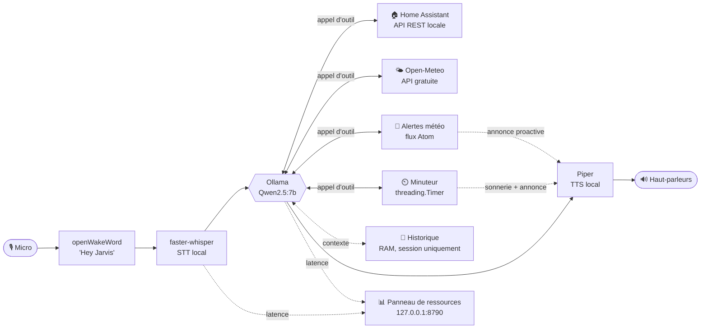

# Architecture

Détail technique du projet : schéma, choix, et fonctionnement de chaque
module. Pour l'installation et le démarrage rapide, voir le
[README](README.md). Pour ce qui est prévu ensuite, voir la
[Roadmap](ROADMAP.md).

## Schéma



| Composant | Technologie | Rôle |
|---|---|---|
| Mot-clé | [openWakeWord](https://github.com/dscripka/openWakeWord) | Détection de "Hey Jarvis", en continu, en local |
| VAD | [Silero VAD](https://github.com/snakers4/silero-vad) | Détecte le début/la fin de la parole (pas un simple seuil de volume) |
| STT | [faster-whisper](https://github.com/SYSTRAN/faster-whisper) | Parole → texte (GPU) |
| LLM | [Ollama](https://ollama.com) (Qwen2.5:7b par défaut) | Modèle de langage, tool-calling, conversation |
| TTS | [Piper](https://github.com/OHF-Voice/piper1-gpl) (voix `fr_FR-tom-medium`) | Texte → parole (CPU) |
| Domotique | [Home Assistant](#domotique--home-assistant-en-local) (API REST, ton réseau) | Allumer/éteindre lumières et prises |
| Météo | [Open-Meteo](#météo) (API gratuite) | Conditions actuelles pour la région configurée |
| Alertes météo | [Environnement Canada](#alertes-météo) (flux Atom) | Avertissements publics, sur demande ou proactifs |
| Minuteur | [`threading.Timer`](#minuteurs) (bibliothèque standard) | Minuteurs vocaux, sonnerie + annonce à l'expiration |
| Historique | `LanguageModel.history` (RAM, en process) | Contexte de la conversation en cours, jamais persisté |
| Panneau de ressources | `http.server` (bibliothèque standard) | Suivi CPU/RAM/VRAM/latences, `127.0.0.1` uniquement |

## Pourquoi ces choix ?

- **Tout tourne en local** (Ollama, faster-whisper, Piper, openWakeWord) :
  aucune voix ni aucun texte n'est envoyé à un service cloud. Seules
  exceptions, volontaires : [Open-Meteo](#météo) et les
  [alertes météo d'Environnement Canada](#alertes-météo) (API fixes,
  gratuites, sans compte) et ton propre serveur
  [Home Assistant](#domotique--home-assistant-en-local) (sur ton réseau, pas
  un cloud tiers).
- **Météo, alertes météo, date/heure, minuteur et domotique contournent le
  LLM générique** (`llm.ask_tool_direct`, voir les sections dédiées) : la
  réponse vient toujours directement de l'outil, jamais d'un texte généré
  par le LLM — plus fiable pour des informations qui doivent être exactes
  (données météo, état réel d'un appareil).
- **Historique de conversation en RAM uniquement, sans persistance disque**
  (voir [section dédiée](#contexte-de-conversation--où-va-lhistorique)) :
  plus respectueux de la vie privée qu'un historique écrit sur disque —
  aucune trace de tes conversations ne persiste une fois l'assistant arrêté.
- **Pipeline séquentiel, sans interruption en cours de réponse** : le micro
  n'écoute pas pendant que Jarvis parle — il faut attendre la fin de sa
  réponse pour reparler (y compris pour dire "merci Jarvis"). Interrompre
  proprement demanderait d'écouter en continu tout en annulant le flux audio
  et l'appel LLM en cours : une vraie source de bugs de synchronisation.
  Limitation connue, pas un oubli.
- **`server/dashboard.py` en `http.server` plutôt qu'un framework web** :
  voir [Roadmap](ROADMAP.md) — pensé comme la première brique d'une future
  API pour les satellites, pas comme un script à part à maintenir en plus.
- **Pas de Docker** : envisagé puis écarté (voir [Roadmap](ROADMAP.md#décisions-écartées))
  — le GPU passthrough sur Windows est plus fragile que le venv natif actuel,
  et une CI sans GPU ne validerait jamais le vrai chemin d'exécution.

## Arborescence

```
assistant-vocal-local/
├── config.yml            # Tes réglages + secrets personnels (ignoré par git)
├── config.yml.example    # Modèle commité, à copier en config.yml
├── launch.py             # Lance Jarvis (+ Open WebUI en option), sans Docker
├── openwebui/            # Open WebUI, venv séparé (voir Open WebUI ci-dessous)
│   └── .venv-openwebui/    # Ignoré par git — pip install open-webui
├── server/              # Tout le code du serveur de traitement (PC)
│   ├── main.py          # Point d'entrée : boucle principale
│   ├── config.py        # Charge config.yml et l'expose au reste du code
│   ├── audio_io.py       # Capture micro (via VAD) + lecture haut-parleurs
│   ├── vad.py             # Détection d'activité vocale (Silero VAD)
│   ├── wakeword.py       # Détection "Hey Jarvis" (openWakeWord)
│   ├── stt.py            # Transcription (faster-whisper)
│   ├── llm.py            # Appel Ollama + historique de session + tool-calling
│   ├── trigger.py           # Détection de phrase-déclencheuse (partagée)
│   ├── weather.py             # Météo actuelle via Open-Meteo (sans clé API)
│   ├── weather_alerts.py       # Alertes météo (flux Atom Environnement Canada)
│   ├── timer.py                 # Minuteurs vocaux (threading.Timer + carillon)
│   ├── date_time.py               # Date et heure actuelles (calcul local)
│   ├── tts.py                       # Synthèse vocale (Piper)
│   ├── home_assistant.py           # Client domotique local + outils LLM
│   └── dashboard.py                  # Panneau de ressources local (CPU/RAM/VRAM)
├── satellite/            # Futur client Raspberry Pi (vide pour l'instant)
├── models/                # Poids/voix téléchargés (ignoré par git, voir models/README.md)
│   ├── piper/              # Voix Piper (.onnx + .onnx.json)
│   └── whisper/             # Cache faster-whisper (rempli automatiquement)
├── tests/                 # Tests pytest (logique pure, sans matériel)
├── .venv/                 # Environnement virtuel (ignoré par git)
├── .gitignore
├── LICENSE
├── README.md
├── ARCHITECTURE.md
├── ROADMAP.md
└── requirements.txt
```

## Modules et configuration

Chaque module optionnel (domotique, météo, alertes météo, panneau de
ressources, Open WebUI, vérification de version) a une clé
`enabled: true/false` propre dans `config.yml` — `home_assistant.enabled`,
`weather.enabled`, `alerts.enabled`, `dashboard.enabled`,
`open_webui.enabled`, `update_check.enabled`.

**Règle uniforme, sans exception : clé absente de `config.yml` =
désactivé.** Il faut toujours un `enabled: true` explicite pour activer un
module — jamais de déduction à partir d'un autre réglage (ex: un `token`
ou `feed_url` rempli n'active plus rien tout seul). Un seul contrat pour
tous, volontairement strict : plus simple à retenir qu'un défaut différent
par module, au prix de devoir taper `enabled: true` même quand le reste
(jeton, URL...) est déjà rempli.

Deux cas distincts, avec un message différent au démarrage :

- **`enabled: false`** (ou absent) : module ignoré, aucune tentative de
  connexion (`⏸️`). C'est le comportement voulu, pas une erreur.
- **`enabled: true` mais mal configuré** (jeton/URL manquant, service
  injoignable) : erreur de configuration explicite (`⚠️`), pour distinguer
  "je n'en veux pas" de "j'ai oublié une étape". L'assistant démarre quand
  même, juste sans ce module.

`timer.py`/`date_time.py` n'ont pas cette clé : ce sont des fonctionnalités
cœur (bibliothèque standard uniquement, aucun mode d'échec), toujours
actives.

**Au démarrage** : `launch.py` imprime `==== Core ====` (Ollama, version,
lancement de Jarvis et d'Open WebUI). `main.py` imprime `==== Modules ====`
juste avant ses propres lignes de statut (domotique/météo/alertes/
dashboard, avec plus de détail que juste actif/inactif — ex: la ville pour
la météo), puis rappelle l'état d'Open WebUI et de la vérification de
version ("géré par launch.py", puisque `main.py` ne les démarre pas).

Deux blocs séparés plutôt qu'un seul : `launch.py` et `main.py` sont deux
process qui écrivent dans la même console sans se synchroniser, et capturer
la sortie de Jarvis pour la réordonner casserait le streaming caractère par
caractère de ses réponses en conversation (`parler_en_flux`, flush à chaque
fragment). Le regroupement suit donc ce que chaque process contrôle
réellement, pas un ordre chronologique strict.

## Installation

`install.ps1` (racine du dépôt, PowerShell — pas Python, volontairement :
au premier lancement, Python n'existe pas encore) automatise tout ce qui
suit. Il ne dépend pas de Git : le dépôt est récupéré en `.zip`
(`Invoke-WebRequest`/`Expand-Archive`, natifs à PowerShell) si le script
n'est pas déjà lancé depuis une copie locale.

**`install.bat`** (racine du dépôt) : les fichiers `.ps1` ne sont jamais
exécutables au double-clic sous Windows (sécurité — Windows demande "avec
quoi l'ouvrir"), contrairement aux `.bat`. Appelle
`powershell -ExecutionPolicy Bypass -File install.ps1` puis `pause` (garde
la fenêtre ouverte), pour double-cliquer sans rien taper.

Étapes, dans l'ordre :

1. Détecte le GPU (`Get-CimInstance Win32_VideoController`) et affiche
   clairement le résultat : NVIDIA → "projet complètement compatible" ;
   AMD ou aucun GPU dédié → "le projet va rouler en CPU, donc quelques
   latences à prévoir" (renvoie vers "GPU AMD" ci-dessous pour ajuster
   `config.yml`). Purement informatif : ne modifie rien automatiquement.
2. Vérifie que `winget` est disponible.
3. **Python 3.11** et **Ollama** : détection via `winget list --id ... -e`
   (fiable, contrairement à `Get-Command python` qui peut trouver le stub
   Windows Store même quand Python n'est pas réellement installé). Si
   absent, **demande confirmation avant d'installer** — jamais silencieux,
   l'utilisateur garde le contrôle sur ce qui s'installe sur sa machine.
   **ffmpeg** (`Gyan.FFmpeg`) suit le même principe — pas requis par Jarvis,
   seulement par les fonctions audio d'Open WebUI (`pydub`, voir
   [Open WebUI](#open-webui)). Proposé même sans Open WebUI installé : ça
   ne fait jamais de mal.
4. Récupère le dépôt si besoin (détecté par la présence de
   `requirements.txt` à côté du script).
5. Une confirmation groupée pour le reste (venv, `pip install`, modèle
   Ollama `qwen2.5:7b` ~4,7 Go, voix Piper) — pas une par paquet Python,
   contrairement à Python/Ollama : ce sont des dépendances du projet
   lui-même, scopées au venv (`.venv/`), pas des installations système.
6. **Ne lance jamais `launch.py`** : affiche la commande à taper, pour que
   le premier lancement (qui capture le micro) reste un geste délibéré.

Rafraîchit le `PATH` de la session après chaque install winget (sinon la
commande fraîchement installée reste invisible tant que PowerShell n'est
pas relancé). Ne vaut que pour la session d'`install.ps1` elle-même — un
terminal déjà ouvert (ex: celui d'où `launch.py` est lancé juste après) ne
le voit pas tant qu'il n'est pas rouvert. `launch.py` fait le même
rafraîchissement de son côté (voir plus bas), donc ça ne se reproduit plus
une fois Jarvis démarré via `launch.py`.

La vérification qu'Ollama répond avant de tirer le modèle utilise une
connexion TCP brute (`System.Net.Sockets.TcpClient`), pas
`Invoke-WebRequest` : plus légère, et sans le risque de rester bloquée sans
lever d'exception que ce dernier a montré dans certaines conditions.

**La fenêtre reste ouverte, succès ou erreur.** Lancé via clic droit >
"Exécuter avec PowerShell" (ou `install.bat`), la fenêtre se ferme *seule*
dès que le script se termine — impossible de lire le dernier message sinon
(commande pour lancer Jarvis, ou erreur). Tout le corps du script est dans
un `try/catch` global qui appelle `Quitter` (`Read-Host` puis `exit`) dans
les deux cas — les erreurs utilisent `throw`, jamais `Write-Error`
(incompatible avec `$ErrorActionPreference = "Stop"` en tête du script,
qui le rendrait bloquant avant d'atteindre la pause).

## Vérification de version

`launch.py` compare le fichier `VERSION` (racine du dépôt, une simple date
`AAAA-MM-JJ`) à celui du dépôt GitHub à chaque démarrage — requête réseau
courte (3s de timeout), silencieuse en cas d'échec, jamais bloquante pour
Jarvis. Un message s'affiche dans les deux cas (à jour ou en retard), pas
seulement en cas de retard :

```
✅ Code à jour (version 2026-09-23).
```
```
⚠️  Nouvelle version disponible sur GitHub (locale : 2026-09-20, distante : 2026-09-23) — https://github.com/pazpop/assistant-vocal-local
```

**Ne met jamais rien à jour automatiquement** — `install.ps1` ne sait pas
mettre à jour une installation existante non plus (il ne fait rien si
`requirements.txt` est déjà présent, voir [Installation](#installation)) :
ce n'est donc volontairement qu'un signal, pas une action. Désactivable via
`update_check.enabled: false` dans `config.yml` (c'est le seul appel
réseau que `launch.py` fait lui-même, en dehors de ceux de Jarvis
documentés ailleurs dans ce fichier).

Pas basé sur Git ni sur le nombre de commits (contrairement à d'autres
projets de l'auteur) : `install.ps1` ne dépend volontairement pas de Git,
donc rien ne garantit qu'un `.git/` existe localement pour compter quoi
que ce soit — un simple fichier texte comparé à sa version distante
fonctionne quelle que soit la méthode d'installation utilisée.

**Maintenance** : `VERSION` doit être incrémenté à la main à chaque
changement notable (même discipline que les dates du "Fait" dans
`ROADMAP.md`) — rien ne le fait automatiquement.

## Installation avancée

### GPU AMD

`faster-whisper` (le STT) s'appuie sur `ctranslate2`, qui ne supporte que
CUDA (NVIDIA) — pas de build ROCm/AMD. Sur une machine AMD :

- Passe `stt.device: cpu` et `stt.compute_type: int8` dans `config.yml` — le
  STT tourne alors sur CPU, plus lentement, surtout avec le modèle `medium`.
- Commente les deux lignes `nvidia-cublas-cu12`/`nvidia-cudnn-cu12` dans
  `requirements.txt` avant l'installation : elles ne servent qu'au GPU
  NVIDIA, donc inutiles dès que le STT tourne sur CPU.

Le reste tourne sans souci : Piper (TTS) est déjà sur CPU par défaut,
openWakeWord est très léger, et Ollama (LLM) a son propre support ROCm
indépendant de ce dépôt.

### Voix Piper

`config.yml` pointe vers `models/piper/fr_FR-tom-medium.onnx`
(`tts.voice_model`) — voix masculine. Pour une voix féminine, remplace
`tom` par `siwis`, à la fois dans la commande de téléchargement
(`python -m piper.download_voices siwis`) et dans `config.yml`.

## Open WebUI

Interface web de conversation par-dessus Ollama, optionnelle, lancée par
`launch.py` — voir [Roadmap](ROADMAP.md#interface-web-de-conversation-open-webui)
pour le raisonnement derrière ce choix (venv natif plutôt que Docker,
conflit de version `onnxruntime` vérifié entre les deux projets).

**Fenêtre séparée** : `launch.py` ouvre Open WebUI dans sa propre console
Windows (`subprocess.CREATE_NEW_CONSOLE`) plutôt que de mélanger ses logs
(verbeux — migrations de base de données, requêtes HTTP) avec ceux de
Jarvis dans la même fenêtre. Jarvis reste dans la fenêtre principale, celle
où `launch.py` a été lancé.

**`RuntimeWarning: Couldn't find ffmpeg or avconv`** (dans les logs d'Open
WebUI, pas ceux de Jarvis) : `pydub`, utilisé par les fonctions audio
propres à Open WebUI (bouton micro, upload de fichiers — sans rapport avec
le pipeline vocal de Jarvis), a besoin du binaire externe **ffmpeg**,
proposé dans `install.ps1` (`Gyan.FFmpeg`, voir [Installation](#installation)).
`launch.py` relit le `PATH` depuis le registre à chaque démarrage pour
couvrir le cas où le terminal a été ouvert avant l'installation de ffmpeg —
un `open-webui serve` lancé à la main, hors `launch.py`, n'en bénéficie
pas.

**Installation** (une fois, dans son propre venv — jamais dans
`server/.venv`) :

```powershell
python -m venv openwebui\.venv-openwebui
openwebui\.venv-openwebui\Scripts\pip install open-webui
```

Puis active-le dans `config.yml` :

```yaml
open_webui:
  enabled: true
  port: 3000
```

`launch.py` le démarre alors automatiquement avec Jarvis
(`http://127.0.0.1:3000`). Sans ce venv installé, `launch.py` continue de
lancer Jarvis normalement, avec un avertissement clair.

**Où vont les données (comptes, historique de chat) ?** Par défaut, Open
WebUI écrit sa base directement dans `site-packages/` à l'intérieur de son
propre venv — perdue si tu recrées `openwebui/.venv-openwebui`. `launch.py`
la redirige vers `openwebui/data/` (variable d'environnement `DATA_DIR`,
gitignored) automatiquement. Si tu lances `open-webui serve` toi-même sans
passer par `launch.py`, pense à définir `DATA_DIR` de la même façon.

**CORS** : par défaut, Open WebUI accepte les requêtes cross-origin depuis
n'importe quel site (`CORS_ALLOW_ORIGIN=*`, avec un avertissement au
démarrage) — un site malveillant ouvert dans le même navigateur pourrait
interroger l'API locale. `launch.py` la restreint à sa propre origine
(`CORS_ALLOW_ORIGIN=http://127.0.0.1:<port>`) quand `open_webui.host` vaut
`127.0.0.1` (le défaut). Sans effet si tu as choisi `0.0.0.0` pour y
accéder depuis un autre appareil du réseau : l'origine du navigateur
distant n'est alors pas prévisible à l'avance, le défaut `*` d'Open WebUI
s'applique.

### Purger les données d'Open WebUI

Deux commandes séparées, pour deux besoins différents — `launch.py` quitte
juste après, sans démarrer la stack :

- **`python launch.py --purge-webui`** : reset complet. Supprime
  `openwebui/data/` entier (historique de chat, comptes, fichiers uploadés,
  index vectoriel) — recréé de zéro au prochain lancement (nouveau compte
  admin à recréer). Aucun prérequis.
- **`python launch.py --purge-webui-memory`** : efface uniquement la
  fonction **Memory** d'Open WebUI (les faits qu'il retient sur toi entre
  les conversations, Réglages > Personnalisation > Mémoire) — laisse
  l'historique de chat et les comptes intacts. Passe par l'API officielle
  d'Open WebUI (`DELETE /api/v1/memories/delete/user`), pas par une
  manipulation directe de `webui.db`. Prérequis :
  1. Open WebUI déjà lancé (`python launch.py`, dans un autre terminal).
  2. **Autoriser les clés API** dans Panneau d'administration > Réglages > Général.
  3. Générer une clé dans Réglages > Compte > Clés API, et la coller dans
     `config.yml` sous `open_webui.api_key`.

Les quatre demandent une confirmation avant d'agir (`y`/`N`) — passe `--yes`
pour l'ignorer (utile dans un script).

**Volontairement pas dans `config.yml`** : purger est un acte destructif —
un interrupteur qui efface tout silencieusement à chaque démarrage est le
genre de réglage qu'on oublie d'avoir activé, jusqu'au jour où on perd un
historique auquel on tenait. Ces deux variantes existent pour purger *en
même temps* que tu démarres la stack (au lieu de purger puis quitter comme
`--purge-webui`/`--purge-webui-memory`), mais restent des options à taper
explicitement à chaque fois :

- **`python launch.py --purge-webui-on-start`** : purge complète juste avant
  de lancer Open WebUI, puis démarre la stack normalement.
- **`python launch.py --purge-webui-memory-on-start`** : démarre la stack,
  attend qu'Open WebUI réponde sur `/health` (jusqu'à 60s), puis purge sa
  mémoire. Si `api_key` est vide ou qu'Open WebUI ne répond pas à temps, un
  avertissement s'affiche et **le reste du démarrage continue normalement**
  (jamais bloquant pour Jarvis).

**Deux purges combinées en même temps ?** (`--purge-webui` +
`--purge-webui-memory`, ou `--purge-webui-on-start` +
`--purge-webui-memory-on-start`) : la purge complète efface `webui.db` en
entier, donc aussi la table qui contient la clé API — la clé de
`config.yml` devient invalide sur cette instance neuve, et `--purge-webui`
ne démarre de toute façon rien (pas de serveur à appeler). `launch.py`
détecte les deux cas et **saute la purge mémoire** (redondante : tout est
déjà vide) avec un message explicite, plutôt que de laisser un appel API
échouer silencieusement ou sans explication.

**`qwen2.5-coder` qui "code" en appelant des outils au lieu de répondre** :
symptôme d'un system prompt pollué par des exemples d'outils Jarvis
(probablement copiés-collés depuis ce README dans un prompt système global
d'Open WebUI). Corrige dans **Espace de travail > Modèles > Créer un
modèle**, basé sur `qwen2.5-coder:7b`, avec son propre system prompt
(vide/neutre) — plutôt que de modifier le prompt système par défaut global
ou la base SQLite d'Open WebUI directement.

## Domotique : Home Assistant en local

Jarvis pilote tes lampes/prises en appelant directement l'**API REST** de ton
serveur Home Assistant (VM, Raspberry Pi ou machine dédiée), tant qu'il est
sur ton réseau local — aucun passage par un cloud, ni par HomeKit. Si tes
appareils sont aussi exposés à Siri/HomePods via l'intégration HomeKit de
HA, ce chemin continue de fonctionner en parallèle, indépendamment de Jarvis.

1. Dans Home Assistant : **Profil (en bas à gauche) > Sécurité > Jetons
   d'accès longue durée > Créer un jeton**. Copie-le, il ne sera plus
   affiché ensuite.
2. Passe `home_assistant.enabled: true` dans `config.yml`, colle le jeton
   sous `home_assistant.token`.
3. Ajuste `home_assistant.base_url` vers l'**adresse IP** de ta VM (ex.
   `http://192.168.1.100:8123`) — évite `homeassistant.local` (mDNS peu
   fiable sous Windows). Réserve si possible une IP fixe pour la VM dans ton
   routeur.
4. Si ta VM sert Home Assistant en HTTPS avec un certificat auto-signé,
   passe `home_assistant.verify_ssl: false` (uniquement sur un réseau local
   de confiance).
5. Au lancement, `main.py` teste la connexion et récupère la liste de tes
   lumières/prises, injectée dans le prompt système pour que le LLM connaisse
   les `entity_id` exacts plutôt que de les deviner.

"Allume"/"éteins" passent par `llm.ask_tool_direct`, sans historique (voir
[Pourquoi ces choix ?](#pourquoi-ces-choix)) : la confirmation vocale
("lumière salon gauche : allumé.") vient directement de l'alias
`device_aliases` (ou de l'`entity_id` à défaut), pas d'une reformulation par
le LLM — un peu moins naturel, mais toujours fidèle à ce qui s'est vraiment
passé.

**Le nom ne correspond pas à ce que tu dis à voix haute ?** Le LLM voit le
`friendly_name` Home Assistant de chaque appareil — souvent redondant pour
les appareils importés via un pont HomeKit (ex: "Salon Lumière Salon
Gauche" pour une lumière que tu appelles "salon gauche"). Ajoute un alias
dans `home_assistant.device_aliases` pour lui donner le nom court que tu
utilises réellement :

```yaml
home_assistant:
  device_aliases:
    light.salon_lumiere_salon_gauche: "lumière salon gauche"
```

Pour retrouver l'`entity_id` exact et le `friendly_name` actuel de tes
appareils (jeton déjà renseigné) :

```powershell
cd server
python -c "from home_assistant import HomeAssistantClient; c = HomeAssistantClient(); [print(e['entity_id'], '->', e['attributes'].get('friendly_name')) for d in ('light','switch') for e in c.lister_appareils(d)]"
```

**Aller plus loin** : seuls `allumer`/`éteindre` sur `light`/`switch` sont
exposés (`DOMAINES_AUTORISES` dans `server/home_assistant.py`). D'autres
domaines ou actions (climatisation, volets...) peuvent s'ajouter en étendant
`HA_TOOLS`, `executer_outil` et `DOMAINES_AUTORISES`.

## Conversation continue

**Confirmation dès le mot-clé** : dès que "Hey Jarvis" est détecté, Jarvis
répond tout de suite "Oui, comment puis-je vous aider ?"
(`conversation.wake_word_prompt`) — un repère clair qu'il écoute bien.
L'écoute de ta question démarre en parallèle de cette phrase, pas après : si
tu enchaînes directement sans attendre qu'elle finisse, ta question est
quand même captée.

Limite à connaître : sur certains micros/haut-parleurs très proches l'un de
l'autre (sans annulation d'écho matérielle), le micro peut capter un peu de
la voix de Jarvis lui-même. Si tu remarques des transcriptions polluées par
"Oui comment puis-je vous aider", baisse le volume des haut-parleurs ou
éloigne-les du micro.

**Phrase d'attente pendant un appel d'outil** : la météo, le minuteur et la
domotique demandent un aller-retour réseau qui prend un instant. Dès que le
LLM décide d'utiliser un de ces outils, Jarvis dit une courte phrase ("Je
vérifie ça.", "Un instant.", "Je m'en occupe." — choisie au hasard parmi
`LLM_TOOL_CALL_PHRASES` dans `config.py`), jouée **en parallèle** de l'appel
réseau plutôt qu'avant : aucune latence ajoutée, juste un silence comblé.
Elle ne se déclenche jamais pour une réponse purement conversationnelle, qui
n'a besoin d'aucun outil.

**Après avoir répondu**, Jarvis réécoute directement — inutile de redire
"Hey Jarvis" pour poser une question de suite. Trois façons dont ça se
termine :

- **À la voix** : dis *"merci Jarvis"* (ou une variante, voir
  `CONVERSATION_END_PHRASES` dans `config.py`) — Jarvis dit au revoir et
  repasse en veille (attente du mot-clé).
- **Silence** : si tu ne dis rien dans les `conversation.followup_timeout`
  secondes (6s par défaut) qui suivent sa réponse, Jarvis repasse en veille
  sans un mot.
- **Incompréhension** : si le STT ne parvient pas à transcrire ce que tu as
  dit, Jarvis le dit à voix haute ("Désolé, je n'ai pas compris. Je repasse
  en veille.") plutôt que de repasser en veille silencieusement.

### Contexte de conversation : où va l'historique ?

Pendant qu'elle dure, Jarvis garde les derniers échanges en tête pour
comprendre les questions de suite ("et l'autre aussi ?"). Concrètement,
c'est une simple liste Python (`LanguageModel.history` dans `server/llm.py`)
qui vit dans la mémoire vive (RAM) du processus `python main.py` — et
uniquement là :

- **Rien n'est écrit sur disque.** Aucun fichier, aucune base de données :
  pas de trace de ta conversation qui persiste une fois l'assistant arrêté.
- **Rien ne part sur Internet.** Cet historique n'est envoyé qu'à Ollama, en
  local sur ce PC (`http://localhost:11434`) — jamais à un service cloud ni
  à un tiers. Les seuls appels réseau sortants du projet sont ceux,
  ponctuels, documentés ci-dessus (Open-Meteo, Environnement Canada, ton
  propre serveur Home Assistant).
- **Tout disparaît au redémarrage.** Ferme l'assistant (Ctrl+C, crash,
  redémarrage...) et cette liste s'efface avec le processus.
- **Réinitialisable à la volée** : dis *"oublie tout"* (ou *"réinitialise ta
  mémoire"*) pour la vider sans redémarrer l'assistant.

`conversation.max_echanges` (20 par défaut) limite la taille de ce contexte,
pour que chaque réponse reste rapide et que le modèle ne se "perde" pas dans
du contenu ancien.

## Localisation (météo + date/heure)

La météo et la date/heure partagent la **même configuration de région**, dans
`config.yml`, pour ne jamais se contredire :

```yaml
location:
  city: "Montréal"              # nom utilisé dans les réponses parlées
  geocode_query: "Montréal, QC"  # requête de localisation pour la météo, plus précise si le nom seul est ambigu
  timezone: "America/Toronto"        # fuseau IANA pour l'heure (Québec/Ontario = heure de l'Est)
```

Si tu déménages ou testes ailleurs, ajuste ces trois valeurs ensemble. La
liste des fuseaux IANA valides est sur
[Wikipedia](https://en.wikipedia.org/wiki/List_of_tz_database_time_zones)
(cherche ta ville ou la plus grande ville proche dans la colonne "TZ
identifier").

## Météo

Jarvis donne la météo actuelle de `location.city`, via
[Open-Meteo](https://open-meteo.com) : gratuit, sans clé API ni compte.
Réservé à un usage **non commercial** (licence CC BY 4.0 des données).

Au démarrage, Jarvis géocode `location.geocode_query` (mis en cache pour la
session) — si ça échoue, la météo démarre désactivée avec un message clair
(pas de repli automatique : la localisation vient uniquement de
`config.yml`). La réponse inclut température, ressenti, ciel et vitesse du
vent.

Demande "quel temps fait-il ?" ou "quel temps fait-il à Paris ?" : le LLM
appelle `obtenir_meteo` et en extrait la ville si une est mentionnée, sinon
utilise celle par défaut. `weather.demande_meteo()` détecte la question par
mots-clés ("météo", "il pleut", "quel temps fait"...) pour l'envoyer via
`llm.ask_tool_direct`, sans historique ni reformulation par le LLM (voir
[Pourquoi ces choix ?](#pourquoi-ces-choix)).

Une réponse est mise en cache 10 minutes par ville (en mémoire) : une
question répétée dans ce délai ne resollicite pas Open-Meteo, pour rester
respectueux d'une API gratuite. Seules les réponses réussies sont mises en
cache, jamais une erreur.

Ville introuvable ou Open-Meteo injoignable : la météo se désactive
proprement, avec un message clair, sans affecter le reste de l'assistant.
Mets `weather.enabled: false` dans `config.yml` pour la désactiver toi-même
volontairement.

## Alertes météo

Donne accès aux alertes météo publiques du Canada (tempête, froid extrême,
etc.), via les [flux Atom gratuits d'Environnement Canada](https://www.canada.ca/en/environment-climate-change/services/weather-general-tools-resources/weatheroffice-online-services/atom-feeds.html) —
gratuit, sans compte, sans clé API, comme Open-Meteo. Parsé avec
`xml.etree.ElementTree` (bibliothèque standard), aucune dépendance
supplémentaire.

1. Trouve l'URL du flux de ta région sur la page ci-dessus. Privilégie
   l'URL en **"\_f.xml"** (français) plutôt que "\_e.xml" (anglais).
2. Passe `enabled: true` et colle l'URL dans `config.yml` :
   ```yaml
   alerts:
     enabled: true
     feed_url: "https://weather.gc.ca/rss/battleboard/qcrm2_f.xml"  # exemple : secteur de Montréal
     check_interval_minutes: 15
     quiet_hours_start: "22:00"
     quiet_hours_end: "08:00"
   ```
3. Laisse `enabled: false` (valeur par défaut) pour désactiver complètement
   cette fonctionnalité.

**Deux façons de l'utiliser :**

- **Sur demande** : "Hey Jarvis, y a-t-il une alerte météo ?" — même patron
  que la météo (`weather_alerts.demande_alerte()`, `llm.ask_tool_direct`).
- **Proactif** : un thread en arrière-plan revérifie le flux toutes les
  `check_interval_minutes` (15 par défaut), et Jarvis t'avertit spontanément
  dès qu'une **nouvelle** alerte apparaît, sans que tu aies à demander.
  Chaque alerte n'est annoncée qu'une fois. Mets `check_interval_minutes: 0`
  pour couper uniquement ce sondage — la vérification à la demande reste
  disponible. L'annonce passe par le même verrou de lecture audio que les
  minuteurs, donc jamais de chevauchement avec une conversation en cours.

`quiet_hours_start`/`quiet_hours_end` coupent l'annonce **proactive** la
nuit (22h-8h par défaut) : une alerte qui apparaît pendant cette période est
ignorée, pas rattrapée au réveil — seule une alerte réellement nouvelle
après la coupure est annoncée. Sans effet sur la demande à la voix, qui
fonctionne à toute heure. Mets les deux heures à la même valeur pour
désactiver cette coupure.

## Date et heure

Demande "Hey Jarvis, quelle heure est-il ?" ou "quelle heure est-il à
Tokyo ?" : sans ville précisée, `obtenir_date_heure` (`server/date_time.py`)
calcule l'heure pour le fuseau `location.timezone` explicitement — pas
l'horloge système, sans appel réseau. Avec une ville nommée, elle est
géocodée à la volée via `weather.geocoder()` (même mécanisme que la météo,
qui renvoie aussi le fuseau horaire du lieu).

`date_time.demande_date_heure()` détecte la question par mots-clés ("quelle
heure", "quel jour"...) pour l'envoyer via `llm.ask_tool_direct`, comme la
météo (voir [Pourquoi ces choix ?](#pourquoi-ces-choix)).

**Windows** : `zoneinfo` a besoin du paquet `tzdata` (dans
`requirements.txt`) car Windows ne fournit pas nativement la base de fuseaux
IANA — sur Linux/macOS, ce paquet est un no-op.

## Minuteurs

Demande "Hey Jarvis, mets un minuteur de 5 minutes" (ou "de 30 secondes",
"de 2 minutes pour les pâtes"...) : le LLM convertit la durée en secondes et
appelle l'outil `demarrer_minuteur` (`server/timer.py`), qui confirme
aussitôt à l'oral, puis sonne à l'expiration — un court carillon suivi de
"Le minuteur est terminé" (ou avec le label précisé).

`timer.demande_minuteur()` détecte la question par mots-clés ("minuteur",
"chronomètre", "compte à rebours") pour l'envoyer via `llm.ask_tool_direct`,
comme la météo (voir [Pourquoi ces choix ?](#pourquoi-ces-choix)).

Chaque minuteur tourne dans son propre thread (continue même si Jarvis
retourne en veille) et reçoit un numéro (1, 2, 3...) à sa création, jamais
réattribué même si un minuteur plus ancien sonne ou est annulé avant — pour
toujours désigner le bon. Plusieurs minuteurs simultanés fonctionnent sans
problème. Le carillon est un bip sinusoïdal généré en code, aucun fichier
audio requis.

"Liste les minuteurs" donne l'état de tous ; "combien de temps reste-t-il
pour le minuteur 1 ?" en précise un seul ; "arrête le minuteur 1"/"arrête
tous les minuteurs" les annule.

```
Toi    : Lance un minuteur de 2 minutes.
Toi    : Lance un minuteur de 5 minutes.
Toi    : Liste les minuteurs.
Jarvis : Il y a 2 minuteurs en cours : minuteur 1 (2 minutes restantes), minuteur 2 (5 minutes restantes).
Toi    : Arrête le premier.
Jarvis : J'ai arrêté le minuteur 1.
```

**Limite à connaître** : si un minuteur sonne pendant que Jarvis parle déjà,
l'annonce attend son tour (`audio_io.py` sérialise toute lecture audio). Si
le minuteur sonne pendant que *toi* tu parles, rien ne retient le carillon :
il peut être capté par le micro en même temps que ta voix, comme pour la
salutation du mot-clé (voir [Conversation continue](#conversation-continue)).

## Panneau de ressources

Au démarrage, l'assistant affiche l'URL d'une petite page locale (ex:
`http://127.0.0.1:8790/`) qui montre en direct l'usage CPU/RAM, la VRAM GPU
(si une carte NVIDIA est détectée via `nvidia-ml-py` — sinon la section est
simplement masquée), et la durée de la dernière transcription (STT) et de la
dernière réponse complète (LLM + TTS).

La page se rafraîchit toutes les 2 secondes (`<meta http-equiv="refresh">`,
aucun JavaScript). Un endpoint `/status` renvoie les mêmes données en JSON.

Passe `dashboard.enabled: false` pour le désactiver complètement (aucun
serveur HTTP lancé). Port configurable via `dashboard.port` (8790 par
défaut). N'écoute que sur `127.0.0.1`, pas conçu pour être exposé au-delà de
ta machine. Implémenté avec `http.server` (bibliothèque standard) plutôt
qu'un framework web — voir [Roadmap](ROADMAP.md).

## Calibrer le micro (`--debug-audio`)

La détection de fin de question utilise un vrai VAD ([Silero](https://github.com/snakers4/silero-vad),
voir `server/vad.py`) plutôt qu'un simple seuil sur le volume : il distingue
correctement une vraie voix du bruit de fond, donc il n'y a normalement
**rien à calibrer** de ce côté. Le modèle est déjà embarqué avec
`faster-whisper`, aucune dépendance ni téléchargement supplémentaire.

Le mot-clé ("Hey Jarvis"), lui, dépend d'un seuil de confiance
(`wake_word.threshold`) propre à openWakeWord. Lance l'assistant avec
`--debug-audio` pour l'ajuster si besoin :

```powershell
cd server
python main.py --debug-audio
```

- **Avant de dire "Hey Jarvis"** : la ligne `[wakeword] score=... max_vu=...
  seuil=0.50` s'affiche en continu. Dis le mot-clé et regarde le `max_vu`
  atteint. S'il reste souvent sous le seuil, baisse `wake_word.threshold`
  (essaie 0.3–0.4).
- **Pendant l'enregistrement de ta question** : la ligne `[audio] vad=...
  seuil=0.50 (parole/silence, X/33)` s'affiche en continu — surtout utile
  pour observer que le VAD fonctionne bien, rarement pour devoir toucher à
  `audio.vad_threshold` (0.5, la valeur recommandée par Silero).

## Points d'attention

- **Micro par défaut** : `sounddevice` utilise le périphérique par défaut de
  Windows, sauf si `audio.input_device` est renseigné dans `config.yml`
  (index ou nom/sous-chaîne). Trouve le tien avec
  `python -c "import sounddevice as sd; print(sd.query_devices())"`.
- **TTS (Piper)** : tourne sur CPU par défaut (`tts.use_cuda: false`) —
  largement suffisant en pratique, et ça laisse ton GPU disponible pour
  Whisper + Qwen2.5.
- **Licence de Piper** : `OHF-Voice/piper1-gpl` est publié en **GPL-3.0**,
  comme ce projet (voir [LICENSE](LICENSE)) — pas de conflit de licence.
- **Chemins de modèles** : `config.py` calcule les chemins vers `models/`
  relativement à sa propre position sur le disque, donc ça fonctionne quel
  que soit le dossier depuis lequel tu lances `python main.py`.
- **GPU** : `stt.device: cuda` suppose que faster-whisper trouve tes DLL
  CUDA/cuDNN (`nvidia-cublas-cu12`/`nvidia-cudnn-cu12`). Pour vérifier que le GPU est bien vu par la
  bonne bibliothèque (`ctranslate2`, déjà installé via `faster-whisper`,
  aucune dépendance à ajouter) :
  ```powershell
  python -c "import ctranslate2; print(ctranslate2.get_cuda_device_count())"
  ```
  `0` ou une erreur au chargement du modèle Whisper ? Repasse temporairement
  en `cpu` pour isoler le problème (voir aussi [GPU AMD](#gpu-amd)).
- **Sécurité du jeton Home Assistant** : vit uniquement dans `config.yml`,
  jamais en dur dans le code. `config.yml` est dans `.gitignore` — seul
  `config.yml.example` (sans secret) est commité.

## Limites connues

- **Pas de compréhension de la négation** : la détection d'une commande
  (météo, minuteur, domotique...) repose sur la simple présence d'une
  phrase-déclencheuse dans ce que tu as dit (`trigger.contient_une_phrase`),
  pas sur le sens complet de la phrase. Dire "n'allume pas la cuisine"
  déclenche quand même l'action "allumer", puisque le mot "allume" y est
  bien présent. Formule tes demandes à l'affirmatif (ex: "éteins la
  cuisine") pour rester fiable.

## Note sur le coût énergétique de conception

Concevoir ce projet avec des agents conversationnels a un coût réel que je
n'ai aucun moyen fiable de chiffrer (ni Anthropic ni Proton ne publient la
consommation par requête). Ce qui est vérifiable : une fois construit,
Jarvis tourne chez moi sur le réseau électrique du Québec, très
majoritairement hydroélectrique
([34,5 g CO2 eq/kWh sur l'ensemble du cycle de vie](https://www.hydroquebec.com/sustainable-development/specialized-documentation/ghg-emissions.html),
contre
[473 g CO2/kWh en moyenne mondiale en 2024](https://ember-energy.org/latest-insights/global-electricity-review-2025/global-electricity-trends/))
— un vrai avantage du "tout en local", indépendant de la phase de conception.
