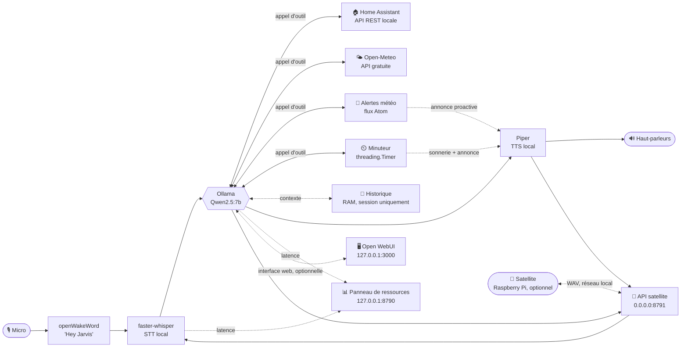
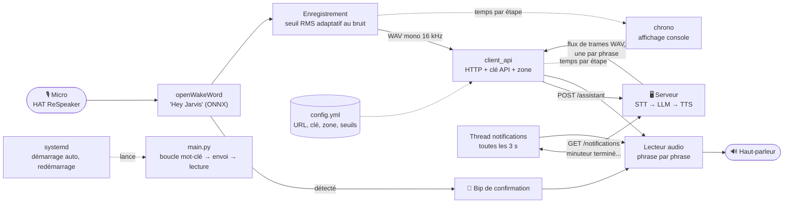

# Architecture

Détail technique du projet : schéma, choix, et fonctionnement de chaque
module. Pour l'installation et le démarrage rapide, voir le
[README](README.md). Pour ce qui est prévu ensuite, voir la
[Roadmap](ROADMAP.md).

## Schéma

Deux types d'hôtes. Le **serveur** (ici un PC Windows) fait tout le
traitement. Un ou plusieurs **satellites** (Raspberry Pi, optionnels) ne
font que capter la voix et jouer la réponse.

### Serveur (exemple : PC Windows)

Les composants ci-dessous tournent tous sur le PC. Sans satellite, le micro et
les haut-parleurs sont ceux du PC.



| Composant (serveur) | Technologie | Rôle |
|---|---|---|
| Mot-clé | [openWakeWord](https://github.com/dscripka/openWakeWord) | Détection de "Hey Jarvis", en continu, en local |
| VAD | [Silero VAD](https://github.com/snakers4/silero-vad) | Détecte le début/la fin de la parole (pas un simple seuil de volume) |
| STT | [faster-whisper](https://github.com/SYSTRAN/faster-whisper) | Parole → texte (GPU) |
| LLM | [Ollama](https://ollama.com) (Qwen2.5:7b par défaut) | Modèle de langage, tool-calling, conversation |
| TTS | [Piper](https://github.com/OHF-Voice/piper1-gpl) (voix `fr_FR-tom-medium`) | Texte → parole (CPU) |
| Domotique | [Home Assistant](#domotique--home-assistant-en-local) (API REST, ton réseau) | Allumer/éteindre lumières et prises |
| Météo | [Open-Meteo](#météo) (API gratuite) | Conditions actuelles et prévision (demain, après-demain) |
| Alertes météo | [Environnement Canada](#alertes-météo) (flux Atom) | Avertissements publics, sur demande ou proactifs |
| Minuteur | [`threading.Timer`](#minuteurs) (bibliothèque standard) | Minuteurs vocaux, sonnerie + annonce à l'expiration |
| Historique | `LanguageModel.history` (RAM, en process) | Contexte de la conversation en cours, jamais persisté |
| Panneau de ressources | `http.server` (bibliothèque standard) | Suivi CPU/RAM/VRAM/latences, `127.0.0.1` uniquement |
| Open WebUI | [Open WebUI](#open-webui) (optionnel, lancé par `launch.py`) | Interface web de conversation par-dessus Ollama, indépendante de Jarvis |
| API satellite | [FastAPI](#api-satellite) (optionnelle, `server/satellite_api.py`) | Expose STT+LLM+TTS+outils en REST au client Raspberry Pi (`satellite/`) |

### Raspberry Pi (satellite)

Client léger (`satellite/`) : aucun modèle de langage, de transcription ni de
synthèse ici. Il détecte le mot-clé, enregistre la question, l'envoie au
serveur ([API satellite](#api-satellite)) et joue ce qu'il reçoit. Matériel :
Raspberry Pi 4 + HAT micro ReSpeaker 2-Mics ([installation](satellite/RASPBERRY_PI_SETUP.md)).



| Composant (Raspberry Pi) | Technologie | Rôle |
|---|---|---|
| Micro / haut-parleur | HAT [ReSpeaker 2-Mics](satellite/RASPBERRY_PI_SETUP.md), `sounddevice` (PortAudio) | Capture et lecture audio |
| Mot-clé | [openWakeWord](https://github.com/dscripka/openWakeWord) (ONNX, `onnxruntime`) | Détection de "Hey Jarvis", en continu, en local |
| Fin de parole | Seuil RMS adaptatif (`numpy`, `audio_io.py`) | Pas de VAD Silero : trop lourd sur un Pi (voir [Client](#client-satellite)) |
| Envoi / réception | `requests` (`client_api.py`) | Envoie le WAV (`POST /assistant`), reçoit les phrases en flux |
| Notifications | Thread de fond (`main.py`) | Réclame au serveur les sons en attente (minuteurs) et les joue |
| Temps par étape | `chrono.py` | Affiche où passe le temps après chaque question |
| Configuration | `satellite/config.yml` | URL du serveur, clé API, zone, seuils audio |
| Démarrage automatique | `systemd` ([README](satellite/README.md#démarrage-automatique-systemd)) | Lance `main.py` au boot et le relance en cas de plantage |

## Pourquoi ces choix

- **Tout tourne en local** (Ollama, faster-whisper, Piper, openWakeWord) :
  aucune voix ni aucun texte n'est envoyé à un service cloud. Seules
  exceptions, volontaires : [Open-Meteo](#météo) et les
  [alertes météo d'Environnement Canada](#alertes-météo) (API fixes,
  gratuites, sans compte) et ton propre serveur
  [Home Assistant](#domotique--home-assistant-en-local) (sur ton réseau, pas
  un cloud tiers).
- **Météo, alertes météo, date/heure, minuteur et domotique contournent le
  LLM générique** (`llm.ask_tool_direct`, voir les sections dédiées) : la
  réponse vient toujours directement de l'outil, jamais d'un texte généré
  par le LLM — plus fiable pour des informations qui doivent être exactes
  (données météo, état réel d'un appareil).
- **Historique de conversation en RAM uniquement, sans persistance disque**
  (voir [section dédiée](#contexte-de-conversation--où-va-lhistorique)) :
  plus respectueux de la vie privée qu'un historique écrit sur disque —
  aucune trace de tes conversations ne persiste une fois l'assistant arrêté.
- **Pipeline séquentiel, sans interruption en cours de réponse** : le micro
  n'écoute pas pendant que Jarvis parle — il faut attendre la fin de sa
  réponse pour reparler (y compris pour dire "merci Jarvis"). Interrompre
  proprement demanderait d'écouter en continu tout en annulant le flux audio
  et l'appel LLM en cours : une vraie source de bugs de synchronisation.
  Limitation connue, pas un oubli.
- **`server/dashboard.py` en `http.server` plutôt qu'un framework web** :
  aucune dépendance pour un simple panneau local.
- **Pas de Docker** : envisagé puis écarté — le GPU passthrough sur Windows
  est plus fragile que le venv natif actuel,
  et une CI sans GPU ne validerait jamais le vrai chemin d'exécution.

## Arborescence

```
assistant-vocal-local/
├── config.yml            # Tes réglages + secrets personnels (ignoré par git)
├── config.yml.example    # Modèle commité, à copier en config.yml
├── launch.py             # Lance Jarvis (+ Open WebUI en option)
├── install.ps1, install.bat  # Installation guidée (Windows)
├── generate_api_key.py   # Génère une clé API aléatoire pour satellite.api_key
├── openwebui/            # Open WebUI, venv séparé (voir Open WebUI ci-dessous)
│   └── .venv-openwebui/    # Ignoré par git — pip install open-webui
├── server/              # Tout le code du serveur de traitement (PC)
│   ├── main.py          # Point d'entrée : boucle principale
│   ├── config.py        # Charge config.yml et l'expose au reste du code
│   ├── audio_io.py       # Capture micro (via VAD) + lecture haut-parleurs
│   ├── vad.py             # Détection d'activité vocale (Silero VAD)
│   ├── wakeword.py       # Détection "Hey Jarvis" (openWakeWord)
│   ├── stt.py            # Transcription (faster-whisper)
│   ├── llm.py            # Appel Ollama + historique de session + tool-calling
│   ├── trigger.py           # Détection de phrase-déclencheuse (partagée)
│   ├── weather.py             # Météo actuelle et prévisions via Open-Meteo (sans clé API)
│   ├── weather_alerts.py       # Alertes météo (flux Atom Environnement Canada)
│   ├── timer.py                 # Minuteurs vocaux (threading.Timer + carillon)
│   ├── date_time.py               # Date et heure actuelles (calcul local)
│   ├── tts.py                       # Synthèse vocale (Piper)
│   ├── home_assistant.py           # Client domotique local + outils LLM
│   ├── dashboard.py                  # Panneau de ressources local (CPU/RAM/VRAM)
│   ├── phrases.py                     # Découpage du flux LLM en phrases, nettoyage Markdown avant la voix
│   └── satellite_api.py               # API réseau pour les satellites (FastAPI)
├── satellite/            # Client Raspberry Pi (mot-clé + micro + haut-parleur)
│   ├── RASPBERRY_PI_SETUP.md # Matériel, OS, pilotes du HAT micro (avant le client)
│   ├── main.py             # Point d'entrée : boucle mot-clé -> envoi -> lecture
│   ├── config.py             # Config allégée (satellite/config.yml, pas config.yml racine)
│   ├── wakeword.py             # Détection "Hey Jarvis" (openWakeWord, copie voulue de server/)
│   ├── audio_io.py               # Capture micro (seuil RMS adaptatif) + lecture haut-parleur
│   ├── client_api.py               # Appel HTTP vers server/satellite_api.py
│   ├── chrono.py                     # Texte des temps par étape affichés après chaque question
│   └── config.yml.example, requirements.txt, README.md, tests/
├── models/                # Poids/voix téléchargés (ignoré par git, voir models/README.md)
│   └── piper/              # Voix Piper (.onnx + .onnx.json)
├── tests/                 # Tests pytest du serveur (satellite/tests/ pour le client)
├── .github/workflows/tests.yml   # CI : tests serveur et tests satellite
├── .venv/                 # Environnement virtuel (ignoré par git)
├── .gitignore
├── LICENSE
├── README.md
├── ARCHITECTURE.md
├── ROADMAP.md
└── requirements.txt
```

## Modules et configuration

Chaque module optionnel (domotique, météo, alertes météo, panneau de
ressources, Open WebUI, vérification de version, API satellite) a une clé
`enabled: true/false` propre dans `config.yml` — `home_assistant.enabled`,
`weather.enabled`, `alerts.enabled`, `dashboard.enabled`,
`open_webui.enabled`, `update_check.enabled`, `satellite.enabled`.

**Règle uniforme, sans exception : clé absente de `config.yml` =
désactivé.** Il faut toujours un `enabled: true` explicite pour activer un
module — jamais de déduction à partir d'un autre réglage (ex: un `token`
ou `feed_url` rempli n'active plus rien tout seul). Un seul contrat pour
tous, volontairement strict : plus simple à retenir qu'un défaut différent
par module, au prix de devoir taper `enabled: true` même quand le reste
(jeton, URL...) est déjà rempli.

Deux cas distincts, avec un message différent au démarrage :

- **`enabled: false`** (ou absent) : module ignoré, aucune tentative de
  connexion (`⏸️`). C'est le comportement voulu, pas une erreur.
- **`enabled: true` mais mal configuré** (jeton/URL manquant, service
  injoignable) : erreur de configuration explicite (`⚠️`), pour distinguer
  "je n'en veux pas" de "j'ai oublié une étape". L'assistant démarre quand
  même, juste sans ce module.

`timer.py`/`date_time.py` n'ont pas cette clé : ce sont des fonctionnalités
cœur (bibliothèque standard uniquement, aucun mode d'échec), toujours
actives.

**Au démarrage**, `launch.py` imprime `==== Core ====` (Ollama, version,
lancement de Jarvis et d'Open WebUI) et `main.py` `==== Modules ====` (état
de chaque module, avec plus de détail : ex. la ville pour la météo). Deux
blocs plutôt qu'un : ce sont deux process qui écrivent dans la même console,
et capturer la sortie de Jarvis pour la réordonner casserait le streaming de
ses réponses.

## Installation

`install.ps1` (racine du dépôt, PowerShell — pas Python, volontairement :
au premier lancement, Python n'existe pas encore) automatise tout ce qui
suit. Il ne dépend pas de Git : le dépôt est récupéré en `.zip`
(`Invoke-WebRequest`/`Expand-Archive`, natifs à PowerShell) si le script
n'est pas déjà lancé depuis une copie locale.

**`install.bat`** (racine du dépôt) : les fichiers `.ps1` ne sont jamais
exécutables au double-clic sous Windows (sécurité — Windows demande "avec
quoi l'ouvrir"), contrairement aux `.bat`. Appelle
`powershell -ExecutionPolicy Bypass -File install.ps1` puis `pause` (garde
la fenêtre ouverte), pour double-cliquer sans rien taper.

Étapes, dans l'ordre :

1. Détecte le GPU (`Get-CimInstance Win32_VideoController`) et affiche
   clairement le résultat : NVIDIA → "projet complètement compatible" ;
   AMD ou aucun GPU dédié → "le projet va rouler en CPU, donc quelques
   latences à prévoir" (renvoie vers "GPU AMD" ci-dessous pour ajuster
   `config.yml`). Purement informatif : ne modifie rien automatiquement.
2. Vérifie que `winget` est disponible.
3. **Python 3.11** et **Ollama** : détection via `winget list --id ... -e`
   (fiable, contrairement à `Get-Command python` qui peut trouver le stub
   Windows Store même quand Python n'est pas réellement installé). Si
   absent, **demande confirmation avant d'installer** — jamais silencieux,
   l'utilisateur garde le contrôle sur ce qui s'installe sur sa machine.
   **ffmpeg** (`Gyan.FFmpeg`) suit le même principe — pas requis par Jarvis,
   seulement par les fonctions audio d'Open WebUI (`pydub`, voir
   [Open WebUI](#open-webui)). Proposé même sans Open WebUI installé : ça
   ne fait jamais de mal.
4. Récupère le dépôt si besoin (détecté par la présence de
   `requirements.txt` à côté du script).
5. Une confirmation groupée pour le reste (venv, `pip install`, modèle
   Ollama `qwen2.5:7b` ~4,7 Go, voix Piper) — pas une par paquet Python,
   contrairement à Python/Ollama : ce sont des dépendances du projet
   lui-même, scopées au venv (`.venv/`), pas des installations système.
6. **Ne lance jamais `launch.py`** : affiche la commande à taper, pour que
   le premier lancement (qui capture le micro) reste un geste délibéré.

`install.ps1` rafraîchit le `PATH` de sa session après chaque install winget
(sinon la commande fraîche reste invisible) ; `launch.py` fait de même à son
démarrage. La fenêtre reste ouverte en cas de succès comme d'erreur (un
`try/catch` global suivi d'une pause), et un échec de `pip`, `ollama pull` ou
du téléchargement de la voix arrête le script avec un message.

## Vérification de version

`launch.py` compare le commit local à celui de `main` sur GitHub (API
`commits/main`) à chaque démarrage — requête courte (3 s), silencieuse en
cas d'échec, jamais bloquante. Un message s'affiche dans les deux cas :

```
✅ Code à jour (a1b2c3d).
```
```
⚠️  Nouvelle version disponible sur GitHub (locale : a1b2c3d, distante : e4f5a6b) — https://github.com/pazpop/assistant-vocal-local
```

**Ne met jamais rien à jour** — `install.ps1` ne sait pas mettre à jour le
code d'une installation existante (s'il trouve déjà `requirements.txt`, il
saute le téléchargement du dépôt) : c'est volontairement un signal, pas une
action. Désactivable via `update_check.enabled: false` (seul appel réseau de
`launch.py` lui-même).

## Installation avancée

### GPU AMD

`faster-whisper` (le STT) s'appuie sur `ctranslate2`, qui ne supporte que
CUDA (NVIDIA) — pas de build ROCm/AMD. Sur une machine AMD :

- Passe `stt.device: cpu` et `stt.compute_type: int8` dans `config.yml` — le
  STT tourne alors sur CPU, plus lentement, surtout avec le modèle `medium`.
- Commente les deux lignes `nvidia-cublas-cu12`/`nvidia-cudnn-cu12` dans
  `requirements.txt` avant l'installation : elles ne servent qu'au GPU
  NVIDIA, donc inutiles dès que le STT tourne sur CPU.

Le reste tourne sans souci : Piper (TTS) est déjà sur CPU par défaut,
openWakeWord est très léger, et Ollama (LLM) a son propre support ROCm
indépendant de ce dépôt.

### Voix Piper

`config.yml` pointe vers `models/piper/fr_FR-tom-medium.onnx`
(`tts.voice_model`) — voix masculine. Pour une voix féminine, remplace
`tom` par `siwis` : `python -m piper.download_voices fr_FR-siwis-medium`, puis
`tts.voice_model: models/piper/fr_FR-siwis-medium.onnx` dans `config.yml`.

## Open WebUI

Interface web de conversation par-dessus Ollama, optionnelle, lancée par
`launch.py`, dans son propre venv (conflit de version `onnxruntime` avec
Jarvis).

**Fenêtre séparée** : Open WebUI s'ouvre dans sa propre console Windows
(logs verbeux), Jarvis reste dans la fenêtre de `launch.py`.

**`RuntimeWarning: Couldn't find ffmpeg or avconv`** (logs d'Open WebUI) :
ses fonctions audio (bouton micro, upload) utilisent `pydub`, qui a besoin de
**ffmpeg** (proposé par `install.ps1`). `launch.py` relit le `PATH` du
registre à chaque démarrage ; un `open-webui serve` lancé à la main n'en
bénéficie pas.

**Installation** (une fois, dans son propre venv — jamais dans
`server/.venv`) :

```powershell
python -m venv openwebui\.venv-openwebui
openwebui\.venv-openwebui\Scripts\pip install open-webui
```

Puis active-le dans `config.yml` :

```yaml
open_webui:
  enabled: true
  port: 3000
```

`launch.py` le démarre alors automatiquement avec Jarvis
(`http://127.0.0.1:3000`). Sans ce venv installé, `launch.py` continue de
lancer Jarvis normalement, avec un avertissement clair.

**Où vont les données (comptes, historique de chat) ?** Par défaut, Open
WebUI écrit sa base directement dans `site-packages/` à l'intérieur de son
propre venv — perdue si tu recrées `openwebui/.venv-openwebui`. `launch.py`
la redirige vers `openwebui/data/` (variable d'environnement `DATA_DIR`,
gitignored) automatiquement. Si tu lances `open-webui serve` toi-même sans
passer par `launch.py`, pense à définir `DATA_DIR` de la même façon.

**CORS** : par défaut, Open WebUI accepte les requêtes cross-origin depuis
n'importe quel site (`CORS_ALLOW_ORIGIN=*`, avec un avertissement au
démarrage) — un site malveillant ouvert dans le même navigateur pourrait
interroger l'API locale. `launch.py` la restreint à sa propre origine
(`CORS_ALLOW_ORIGIN=http://127.0.0.1:<port>`) quand `open_webui.host` vaut
`127.0.0.1` (le défaut). Sans effet si tu as choisi `0.0.0.0` pour y
accéder depuis un autre appareil du réseau : l'origine du navigateur
distant n'est alors pas prévisible à l'avance, le défaut `*` d'Open WebUI
s'applique.

### Purger les données d'Open WebUI

Actes destructifs : **options de lancement** à taper à chaque fois, jamais
un réglage de `config.yml` (un interrupteur qu'on oublie d'avoir activé
effacerait tout en silence). Chacune demande confirmation (`--yes` pour
l'ignorer).

| Option | Effet |
|---|---|
| `--purge-webui` | Reset complet : supprime `openwebui/data/` (chats, comptes, fichiers, index). Quitte ensuite. |
| `--purge-webui-memory` | Efface seulement la fonction Memory (API `DELETE /api/v1/memories/delete/user`). Quitte ensuite. |
| `--purge-webui-on-start` | Purge complète juste avant de lancer Open WebUI, puis démarre la stack. |
| `--purge-webui-memory-on-start` | Démarre la stack, attend `/health` (60 s max), puis purge la mémoire. Sans réponse ou sans `api_key`, un avertissement s'affiche et le démarrage continue. |

Prérequis de la purge mémoire : Open WebUI lancé, « Autoriser les clés API »
activé (Panneau d'administration > Réglages > Général), et une clé (Réglages
> Compte > Clés API) collée dans `open_webui.api_key`. Les deux purges
combinées : la complète efface aussi la clé API, `launch.py` saute donc la
purge mémoire avec un message.

**`qwen2.5-coder` qui recrache des appels d'outils au lieu de coder** : ce
sont les « Outils intégrés » d'Open WebUI (tâches, mémoire, recherche web...),
injectés par défaut à tous les modèles. Crée un modèle personnalisé
(**Espace de travail > Modèles**) avec **Capacités > Outils intégrés**
décoché.

## Domotique : Home Assistant en local

Jarvis pilote tes lampes/prises en appelant directement l'**API REST** de ton
serveur Home Assistant (VM, Raspberry Pi ou machine dédiée), tant qu'il est
sur ton réseau local — aucun passage par un cloud, ni par HomeKit. Si tes
appareils sont aussi exposés à Siri/HomePods via l'intégration HomeKit de
HA, ce chemin continue de fonctionner en parallèle, indépendamment de Jarvis.

1. Dans Home Assistant : **Profil (en bas à gauche) > Sécurité > Jetons
   d'accès longue durée > Créer un jeton**. Copie-le, il ne sera plus
   affiché ensuite.
2. Passe `home_assistant.enabled: true` dans `config.yml`, colle le jeton
   sous `home_assistant.token`.
3. Ajuste `home_assistant.base_url` vers l'**adresse IP** de ta VM (ex.
   `http://192.168.1.100:8123`) — évite `homeassistant.local` (mDNS peu
   fiable sous Windows). Réserve si possible une IP fixe pour la VM dans ton
   routeur.
4. Si ta VM sert Home Assistant en HTTPS avec un certificat auto-signé,
   passe `home_assistant.verify_ssl: false` (uniquement sur un réseau local
   de confiance).
5. Au lancement, `main.py` teste la connexion et récupère la liste de tes
   lumières/prises, injectée dans le prompt système pour que le LLM connaisse
   les `entity_id` exacts plutôt que de les deviner.

"Allume"/"éteins" passent par `llm.ask_tool_direct`, sans historique (voir
[Pourquoi ces choix ?](#pourquoi-ces-choix)) : la confirmation vocale
("lumière salon gauche : allumé.") vient directement de l'alias
`device_aliases` (ou de l'`entity_id` à défaut), pas d'une reformulation par
le LLM — un peu moins naturel, mais toujours fidèle à ce qui s'est vraiment
passé.

Home Assistant répond 200 même pour un `entity_id` inexistant : dans ce cas
(liste de changements vide), Jarvis vérifie l'entité et dit « Je ne trouve
pas l'appareil … » plutôt que de confirmer une action sans effet.

**Le nom ne correspond pas à ce que tu dis à voix haute ?** Le LLM voit le
`friendly_name` Home Assistant de chaque appareil — souvent redondant pour
les appareils importés via un pont HomeKit (ex: "Salon Lumière Salon
Gauche" pour une lumière que tu appelles "salon gauche"). Ajoute un alias
dans `home_assistant.device_aliases` pour lui donner le nom court que tu
utilises réellement :

```yaml
home_assistant:
  device_aliases:
    light.salon_lumiere_salon_gauche: "lumière salon gauche"
```

Pour retrouver l'`entity_id` exact et le `friendly_name` actuel de tes
appareils (jeton déjà renseigné) :

```powershell
cd server
python -c "from home_assistant import HomeAssistantClient; c = HomeAssistantClient(); [print(e['entity_id'], '->', e['attributes'].get('friendly_name')) for d in ('light','switch') for e in c.lister_appareils(d)]"
```

**Aller plus loin** : seuls `allumer`/`éteindre` sur `light`/`switch` sont
exposés (`DOMAINES_AUTORISES` dans `server/home_assistant.py`). D'autres
domaines ou actions (climatisation, volets...) peuvent s'ajouter en étendant
`HA_TOOLS`, `executer_outil` et `DOMAINES_AUTORISES`.

## Conversation continue

**Confirmation dès le mot-clé** : dès que "Hey Jarvis" est détecté, Jarvis
répond tout de suite "Oui, comment puis-je vous aider ?"
(`conversation.wake_word_prompt`) — un repère clair qu'il écoute bien.
L'écoute de ta question démarre en parallèle de cette phrase, pas après : si
tu enchaînes directement sans attendre qu'elle finisse, ta question est
quand même captée.

Limite à connaître : sur certains micros/haut-parleurs très proches l'un de
l'autre (sans annulation d'écho matérielle), le micro peut capter un peu de
la voix de Jarvis lui-même. Si tu remarques des transcriptions polluées par
"Oui comment puis-je vous aider", baisse le volume des haut-parleurs ou
éloigne-les du micro.

**Phrase d'attente pendant un appel d'outil** : la météo, le minuteur et la
domotique demandent un aller-retour réseau qui prend un instant. Dès que le
LLM décide d'utiliser un de ces outils, Jarvis dit une courte phrase ("Je
vérifie ça.", "Un instant.", "Je m'en occupe." — choisie au hasard parmi
`LLM_TOOL_CALL_PHRASES` dans `config.py`), jouée **en parallèle** de l'appel
réseau plutôt qu'avant : aucune latence ajoutée, juste un silence comblé.
Elle ne se déclenche jamais pour une réponse purement conversationnelle, qui
n'a besoin d'aucun outil.

**Après avoir répondu**, Jarvis réécoute directement — inutile de redire
"Hey Jarvis" pour poser une question de suite. Trois façons dont ça se
termine :

- **À la voix** : dis *"merci Jarvis"* (ou une variante, voir
  `CONVERSATION_END_PHRASES` dans `config.py`) — Jarvis dit au revoir et
  repasse en veille (attente du mot-clé). Seulement si la phrase se limite à la
  formule (3 autres mots au plus) : « merci Jarvis, quelle heure est-il ? » est
  traité comme une question.
- **Silence** : si tu ne dis rien dans les `conversation.followup_timeout`
  secondes (6s par défaut) qui suivent sa réponse, Jarvis repasse en veille
  sans un mot. Idem après le mot-clé si personne ne parle dans les
  `conversation.first_timeout` secondes (8s) : un faux déclenchement ne
  bloque pas le micro.
- **Incompréhension** : si le STT ne parvient pas à transcrire ce que tu as
  dit, Jarvis le dit à voix haute ("Désolé, je n'ai pas compris. Je repasse
  en veille.") plutôt que de repasser en veille silencieusement.

### Contexte de conversation : où va l'historique

Pendant qu'elle dure, Jarvis garde les derniers échanges en tête pour
comprendre les questions de suite ("et l'autre aussi ?"). Concrètement,
c'est une simple liste Python (`LanguageModel.history` dans `server/llm.py`)
qui vit dans la mémoire vive (RAM) du processus `python main.py` — et
uniquement là :

- **Rien n'est écrit sur disque.** Aucun fichier, aucune base de données :
  pas de trace de ta conversation qui persiste une fois l'assistant arrêté.
- **Rien ne part sur Internet.** Cet historique n'est envoyé qu'à Ollama, en
  local sur ce PC (`http://localhost:11434`) — jamais à un service cloud ni
  à un tiers. Les seuls appels réseau sortants du projet sont ceux,
  ponctuels, documentés ci-dessus (Open-Meteo, Environnement Canada, ton
  propre serveur Home Assistant).
- **Tout disparaît au redémarrage.** Ferme l'assistant (Ctrl+C, crash,
  redémarrage...) et cette liste s'efface avec le processus.
- **Réinitialisable à la volée** : dis *"oublie tout"* (ou *"réinitialise ta
  mémoire"*) pour la vider sans redémarrer l'assistant.

`conversation.max_echanges` (20 par défaut) limite la taille de ce contexte,
pour que chaque réponse reste rapide et que le modèle ne se "perde" pas dans
du contenu ancien.

## Localisation (météo + date/heure)

La météo et la date/heure partagent la **même configuration de région**, dans
`config.yml`, pour ne jamais se contredire :

```yaml
location:
  city: "Montréal"              # nom utilisé dans les réponses parlées
  geocode_query: "Montréal, QC"  # requête de localisation pour la météo, plus précise si le nom seul est ambigu
  timezone: "America/Toronto"        # fuseau IANA pour l'heure (Québec/Ontario = heure de l'Est)
```

Si tu déménages ou testes ailleurs, ajuste ces trois valeurs ensemble. La
liste des fuseaux IANA valides est sur
[Wikipedia](https://en.wikipedia.org/wiki/List_of_tz_database_time_zones)
(cherche ta ville ou la plus grande ville proche dans la colonne "TZ
identifier").

## Météo

Jarvis donne la météo actuelle et la prévision de demain ou d'après-demain
de `location.city`, via
[Open-Meteo](https://open-meteo.com) : gratuit, sans clé API ni compte.
Réservé à un usage **non commercial** (licence CC BY 4.0 des données).

Au démarrage, Jarvis géocode `location.geocode_query` (mis en cache pour la
session) — si ça échoue, la météo démarre désactivée avec un message clair
(pas de repli automatique : la localisation vient uniquement de
`config.yml`). La météo actuelle inclut température, ressenti, ciel et
vitesse du vent.

Demande "quel temps fait-il ?" ou "quel temps fait-il à Paris ?" : le LLM
appelle `obtenir_meteo` et en extrait la ville si une est mentionnée, sinon
utilise celle par défaut. Si la question parle de "demain" ("quelle est la
météo pour demain ?", "va-t-il pleuvoir après-demain ?"),
`weather.outils_meteo()` choisit `obtenir_prevision_meteo` (conditions,
températures min/max, probabilité de précipitations si ≥ 20 %) : le choix de
l'outil est fait par mots-clés, pas par le LLM, qui n'extrait que le jour et
la ville. `weather.demande_meteo()` détecte la question ("météo", "il pleut",
"quel temps fera"...) pour l'envoyer via `llm.ask_tool_direct`, sans
historique ni reformulation par le LLM (voir
[Pourquoi ces choix ?](#pourquoi-ces-choix)).

Une réponse est mise en cache 10 minutes par ville et par jour (en
mémoire) : une question répétée dans ce délai ne resollicite pas Open-Meteo, pour rester
respectueux d'une API gratuite. Seules les réponses réussies sont mises en
cache, jamais une erreur.

Ville par défaut introuvable au démarrage : la météo est désactivée avec un
message clair, sans affecter le reste de l'assistant. Pendant l'usage, une
erreur réseau ou une réponse incomplète d'Open-Meteo donne un message parlé,
sans rien désactiver. Désactivée par défaut : `weather.enabled: true` pour
l'activer.

## Alertes météo

Donne accès aux alertes météo publiques du Canada (tempête, froid extrême,
etc.), via les [flux Atom gratuits d'Environnement Canada](https://www.canada.ca/en/environment-climate-change/services/weather-general-tools-resources/weatheroffice-online-services/atom-feeds.html) —
gratuit, sans compte, sans clé API, comme Open-Meteo. Parsé avec
`xml.etree.ElementTree` (bibliothèque standard), aucune dépendance
supplémentaire.

1. Trouve l'URL du flux de ta région sur la page ci-dessus. Privilégie
   l'URL en **"\_f.xml"** (français) plutôt que "\_e.xml" (anglais).
2. Passe `enabled: true` et colle l'URL dans `config.yml` :
   ```yaml
   alerts:
     enabled: true
     feed_url: "https://weather.gc.ca/rss/battleboard/qcrm2_f.xml"  # exemple : secteur de Montréal
     check_interval_minutes: 15
     quiet_hours_start: "22:00"
     quiet_hours_end: "08:00"
   ```
3. Laisse `enabled: false` (valeur par défaut) pour désactiver complètement
   cette fonctionnalité.

**Deux façons de l'utiliser :**

- **Sur demande** : "Hey Jarvis, y a-t-il une alerte météo ?" — même patron
  que la météo (`weather_alerts.demande_alerte()`, `llm.ask_tool_direct`).
- **Proactif** : un thread en arrière-plan revérifie le flux toutes les
  `check_interval_minutes` (15 par défaut), et Jarvis t'avertit spontanément
  dès qu'une **nouvelle** alerte apparaît, sans que tu aies à demander.
  Chaque alerte n'est annoncée qu'une fois. Mets `check_interval_minutes: 0`
  pour couper uniquement ce sondage — la vérification à la demande reste
  disponible. L'annonce passe par le même verrou de lecture audio que les
  minuteurs, donc jamais de chevauchement avec une conversation en cours.

`quiet_hours_start`/`quiet_hours_end` coupent l'annonce **proactive** la
nuit (22h-8h par défaut) : une alerte qui apparaît pendant cette période est
ignorée, pas rattrapée au réveil — seule une alerte réellement nouvelle
après la coupure est annoncée. Sans effet sur la demande à la voix, qui
fonctionne à toute heure. Mets les deux heures à la même valeur pour
désactiver cette coupure.

## Date et heure

Demande "Hey Jarvis, quelle heure est-il ?" ou "quelle heure est-il à
Tokyo ?" : sans ville précisée, `obtenir_date_heure` (`server/date_time.py`)
calcule l'heure pour le fuseau `location.timezone` explicitement — pas
l'horloge système, sans appel réseau. Avec une ville nommée, elle est
géocodée à la volée via `weather.geocoder()` (même mécanisme que la météo,
qui renvoie aussi le fuseau horaire du lieu).

`date_time.demande_date_heure()` détecte la question par mots-clés ("quelle
heure", "quel jour"...) pour l'envoyer via `llm.ask_tool_direct`, comme la
météo (voir [Pourquoi ces choix ?](#pourquoi-ces-choix)).

**Windows** : `zoneinfo` a besoin du paquet `tzdata` (dans
`requirements.txt`) car Windows ne fournit pas nativement la base de fuseaux
IANA — sur Linux/macOS, ce paquet est un no-op.

## Minuteurs

Demande "Hey Jarvis, mets un minuteur de 5 minutes" (ou "de 30 secondes",
"de 2 minutes pour les pâtes"...) : le LLM convertit la durée en secondes et
appelle l'outil `demarrer_minuteur` (`server/timer.py`), qui confirme
aussitôt à l'oral, puis sonne à l'expiration — un court carillon suivi de
"Le minuteur est terminé" (ou avec le label précisé).

`timer.demande_minuteur()` détecte la question par mots-clés ("minuteur",
"chronomètre", "compte à rebours") pour l'envoyer via `llm.ask_tool_direct`,
comme la météo (voir [Pourquoi ces choix ?](#pourquoi-ces-choix)).

Chaque minuteur tourne dans son propre thread (continue même si Jarvis
retourne en veille) et reçoit un numéro (1, 2, 3...) à sa création, jamais
réattribué même si un minuteur plus ancien sonne ou est annulé avant — pour
toujours désigner le bon. Plusieurs minuteurs simultanés fonctionnent sans
problème. Demandé depuis un satellite, un minuteur sonne sur ce satellite
(voir [API satellite](#api-satellite)). Le carillon est un bip sinusoïdal généré en code, aucun fichier
audio requis.

"Liste les minuteurs" donne l'état de tous ; "combien de temps reste-t-il
pour le minuteur 1 ?" en précise un seul ; "arrête le minuteur 1"/"arrête
tous les minuteurs" les annule.

```
Toi    : Lance un minuteur de 2 minutes.
Toi    : Lance un minuteur de 5 minutes.
Toi    : Liste les minuteurs.
Jarvis : Il y a 2 minuteurs en cours : minuteur 1 (2 minutes restantes), minuteur 2 (5 minutes restantes).
Toi    : Arrête le premier.
Jarvis : J'ai arrêté le minuteur 1.
```

**Limite à connaître** : si un minuteur sonne pendant que Jarvis parle déjà,
l'annonce attend son tour (`audio_io.py` sérialise toute lecture audio). Si
le minuteur sonne pendant que *toi* tu parles, rien ne retient le carillon :
il peut être capté par le micro en même temps que ta voix, comme pour la
salutation du mot-clé (voir [Conversation continue](#conversation-continue)).

## Panneau de ressources

Au démarrage, l'assistant affiche l'URL d'une petite page locale (ex:
`http://127.0.0.1:8790/`) qui montre en direct l'usage CPU/RAM, la VRAM GPU
(si une carte NVIDIA est détectée via `nvidia-ml-py` — sinon la section est
simplement masquée), et la durée de la dernière transcription (STT) et de la
dernière réponse complète (LLM + TTS).

La page se rafraîchit toutes les 2 secondes (`<meta http-equiv="refresh">`,
aucun JavaScript). Un endpoint `/status` renvoie les mêmes données en JSON.

Désactivé par défaut : `dashboard.enabled: true` pour le lancer. Port
configurable via `dashboard.port` (8790 par défaut). N'écoute que sur
`127.0.0.1`, pas conçu pour être exposé au-delà de ta machine.

## API satellite

`server/satellite_api.py` expose deux routes au client Raspberry Pi (voir
[Roadmap](ROADMAP.md#satellites-raspberry-pi)) :

- `POST /assistant` : le satellite envoie un WAV brut (corps de la requête,
  mono, 16 bits, 16 kHz — le format de `record_until_silence`, 60 s max) avec
  son nom de zone (`X-Zone`) ; Jarvis fait tourner STT → LLM/outils → TTS
  et renvoie la réponse **en flux, phrase par phrase**.
- `GET /notifications` : les sons mis de côté pour ce satellite (minuteur
  terminé...). Le satellite n'accepte aucune connexion entrante : un thread
  de fond les réclame toutes les 3 s. Un minuteur demandé à un satellite
  sonne chez lui (`TimerManager` retient l'`origine`), pas sur le PC.

Tout le traitement reste sur ce PC : le satellite n'a besoin que d'un
micro/haut-parleur, aucun modèle chargé localement.

**Pourquoi en flux** : sans ça, le satellite attendrait « LLM complet + TTS
complet » avant d'entendre quoi que ce soit — plus la réponse est longue,
plus l'attente l'est. En flux, chaque phrase est synthétisée dès qu'elle est
complète dans le flux du LLM (`phrases.decouper_en_phrases`, le même
découpage que la boucle micro locale) puis envoyée aussitôt : le satellite
commence à parler après la première phrase, pendant que la suite est encore
en train d'être générée.

**Format de la réponse** : une suite de trames, chacune = 4 octets (entier
big-endian non signé : taille N) suivis de N octets d'un WAV mono 16 bits
complet (qui porte sa propre fréquence d'échantillonnage). Fin de flux = fin
de la connexion HTTP. Le client (`satellite/client_api.py`) reconstitue les
trames au fur et à mesure de l'arrivée des octets et joue chaque phrase
pendant que le serveur prépare la suivante.

```yaml
satellite:
  enabled: true
  host: "0.0.0.0"  # joignable depuis le réseau local, pas juste cette machine
  port: 8791
  api_key: "colle-ici-un-jeton-aléatoire"  # même valeur côté satellite — génère-en un avec `python generate_api_key.py`
```

**Toujours protégée par une clé API** (en-tête `X-API-Key`, vérifiée avant
de lire le corps), contrairement au panneau de ressources : cette API écoute
sur `0.0.0.0` par défaut, donc joignable par tout appareil du réseau.
`main.py` refuse de la démarrer (avec un avertissement) si `api_key` est
vide ou fait moins de 16 caractères. Corps limité à ~2 Mo (413), WAV refusé
si ce n'est pas du mono 16 bits 16 kHz (400). **HTTP en clair** : clé et
audio circulent sans chiffrement, à réserver à un réseau de confiance (ou à
placer derrière WireGuard/Tailscale, voir [Roadmap](ROADMAP.md)).

`repondre_flux` (dans `main.py`) réutilise `choisir_reponse` — le même
routage vers `llm.ask_tool_direct`/`ask_with_tools` que la boucle micro
locale — et le même `LanguageModel` (donc le même historique de
conversation) : un satellite est une autre façon de parler à Jarvis, pas une
seconde instance. Un verrou garantit un seul tour de conversation (et une
seule transcription) à la fois, micro local et satellites confondus.
Contrairement à la boucle micro, pas de phrase d'attente ("Je vérifie
ça...") pendant un appel d'outil : le satellite n'a rien à jouer tant que la
première phrase de la vraie réponse n'est pas prête.

### Client (`satellite/`)

Installation autonome (son propre venv, son propre `config.yml`) à faire
tourner sur le Raspberry Pi — voir
[satellite/RASPBERRY_PI_SETUP.md](satellite/RASPBERRY_PI_SETUP.md) pour le
matériel/l'OS/les pilotes du HAT micro, puis
[satellite/README.md](satellite/README.md) pour le client lui-même.

N'importe **rien** de `server/` (pas d'import cross-dossier ; `wakeword.py` et
les conversions WAV en sont des copies voulues). STT/LLM/TTS/outils n'existent
que côté serveur : le satellite n'a que le strict nécessaire pour capter la
voix et jouer la réponse — `main.py` (boucle mot-clé → enregistrement →
`client_api.demander()` → lecture), `wakeword.py`, `audio_io.py`
(capture/lecture), `client_api.py` (appel HTTP).

**Pas de VAD Silero côté satellite**, contrairement au serveur : ce modèle
est normalement récupéré depuis l'installation de faster-whisper
(`get_assets_path()`), qui n'a aucune raison d'être installée sur le
satellite (STT reste géré côté serveur) ; et le paquet `silero-vad` sur PyPI
dépend de PyTorch même pour son mode ONNX — bien trop lourd sur un
Raspberry Pi juste pour détecter un silence. `satellite/audio_io.py` utilise
donc un seuil de volume (RMS) : 2 × le bruit de fond mesuré au début de
chaque enregistrement (plafonné, `audio.silence_threshold` servant de
plancher) : un seuil fixe échouerait avec un HAT micro au bruit de fond élevé
(fin de parole jamais détectée, attente jusqu'à la durée max). Moins
robuste que le VAD du serveur face à un bruit de fond très variable (télé,
radio) — limite connue, pas un oubli.

**Version minimale, pas de conversation continue** : chaque question repart
du mot-clé ("Hey Jarvis" à chaque tour), contrairement à la boucle micro
locale — voir [Roadmap](ROADMAP.md#satellites-raspberry-pi). Le serveur
garde quand même l'historique entre les tours (même `LanguageModel` que la
boucle micro, voir plus haut), donc les questions de suivi fonctionnent déjà
côté serveur ; seule l'absence de redéclenchement automatique après une
réponse est une limite du client.

## Calibrer le micro (`--debug-audio`)

La détection de fin de question utilise un vrai VAD ([Silero](https://github.com/snakers4/silero-vad),
voir `server/vad.py`) plutôt qu'un simple seuil sur le volume : il distingue
correctement une vraie voix du bruit de fond, donc il n'y a normalement
**rien à calibrer** de ce côté. Le modèle est déjà embarqué avec
`faster-whisper`, aucune dépendance ni téléchargement supplémentaire.

Le mot-clé ("Hey Jarvis"), lui, dépend d'un seuil de confiance
(`wake_word.threshold`) propre à openWakeWord. Lance l'assistant avec
`--debug-audio` pour l'ajuster si besoin :

```powershell
cd server
python main.py --debug-audio
```

- **Avant de dire "Hey Jarvis"** : la ligne `[wakeword] score=... max_vu=...
  seuil=0.50` s'affiche en continu. Dis le mot-clé et regarde le `max_vu`
  atteint. S'il reste souvent sous le seuil, baisse `wake_word.threshold`
  (essaie 0.3–0.4).
- **Pendant l'enregistrement de ta question** : la ligne `[audio] vad=...
  seuil=0.50 (parole/silence, X/N)` s'affiche en continu (X/N = blocs de
  silence comptés / requis, N ≈ 31 avec `silence_duration: 1.0`). Surtout
  utile pour observer que le VAD fonctionne, rarement pour toucher à
  `audio.vad_threshold` (0.5, la valeur recommandée par Silero).

## Points d'attention

- **Micro par défaut** : `sounddevice` utilise le périphérique par défaut de
  Windows, sauf si `audio.input_device` est renseigné dans `config.yml`
  (index ou nom/sous-chaîne). Trouve le tien avec
  `python -c "import sounddevice as sd; print(sd.query_devices())"`.
- **TTS (Piper)** : tourne sur CPU par défaut (`tts.use_cuda: false`) —
  largement suffisant en pratique, et ça laisse ton GPU disponible pour
  Whisper + Qwen2.5.
- **Licence de Piper** : `OHF-Voice/piper1-gpl` est publié en **GPL-3.0**,
  comme ce projet (voir [LICENSE](LICENSE)) — pas de conflit de licence.
- **Chemins de modèles** : `config.py` calcule les chemins vers `models/`
  relativement à sa propre position sur le disque, donc ça fonctionne quel
  que soit le dossier depuis lequel tu lances `python main.py`.
- **GPU** : `stt.device: cuda` suppose que faster-whisper trouve tes DLL
  CUDA/cuDNN (`nvidia-cublas-cu12`/`nvidia-cudnn-cu12`). Pour vérifier que
  le GPU est vu par `ctranslate2` (déjà installé avec `faster-whisper`) :
  ```powershell
  python -c "import ctranslate2; print(ctranslate2.get_cuda_device_count())"
  ```
  `0` ou une erreur au chargement du modèle Whisper ? Repasse temporairement
  en `cpu` pour isoler le problème (voir aussi [GPU AMD](#gpu-amd)).
- **Sécurité du jeton Home Assistant** : vit uniquement dans `config.yml`,
  jamais en dur dans le code. `config.yml` est dans `.gitignore` — seul
  `config.yml.example` (sans secret) est commité.

## Limites connues

- **Pas de compréhension de la négation** : la détection d'une commande
  (météo, minuteur, domotique...) repose sur la simple présence d'une
  phrase-déclencheuse dans ce que tu as dit (`trigger.contient_une_phrase`),
  pas sur le sens complet de la phrase. Dire "n'allume pas la cuisine"
  déclenche quand même l'action "allumer", puisque le mot "allume" y est
  bien présent. Formule tes demandes à l'affirmatif (ex: "éteins la
  cuisine") pour rester fiable.

## Note sur le coût énergétique de conception

Concevoir ce projet avec des agents conversationnels a un coût réel que je
n'ai aucun moyen fiable de chiffrer (ni Anthropic ni Proton ne publient la
consommation par requête). Ce qui est vérifiable : une fois construit,
Jarvis tourne chez moi sur le réseau électrique du Québec, très
majoritairement hydroélectrique
([34,5 g CO2 eq/kWh sur l'ensemble du cycle de vie](https://www.hydroquebec.com/sustainable-development/specialized-documentation/ghg-emissions.html),
contre
[473 g CO2/kWh en moyenne mondiale en 2024](https://ember-energy.org/latest-insights/global-electricity-review-2025/global-electricity-trends/))
— un vrai avantage du "tout en local", indépendant de la phase de conception.
