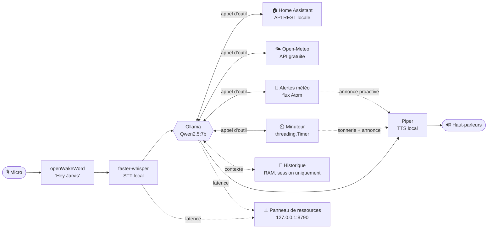

# 🎙️ Jarvis maison — assistant vocal local (STT → LLM → TTS)

Assistant vocal francophone qui tourne **entièrement en local** : détection
de mot-clé, reconnaissance vocale, réponses générées par un LLM local
(Ollama), synthèse vocale, et pilotage de la domotique via Home Assistant —
sans dépendre d'un service cloud tiers.

> Conçu par [pazpop](https://github.com/pazpop), en collaboration avec
> [Claude](https://claude.com) (Anthropic) pour l'architecture et
> l'implémentation — voir [Crédits](#-crédits--inspiration).

> Aujourd'hui : tout tourne sur un PC Windows avec GPU (`server/`).
> Demain : des satellites Raspberry Pi (`satellite/`) captureront la voix et
> délégueront le traitement lourd à ce même serveur (voir
> [Roadmap](#️-roadmap)).

## 🎓 Pourquoi ce projet ?

Je (pazpop) ne suis pas développeur de métier. J'ai commencé ce projet pour
comprendre concrètement comment fonctionne un assistant vocal comme Siri —
les briques qui s'assemblent (mot-clé, VAD, STT, LLM, TTS), et jusqu'où on
peut aller en restant 100% local. C'est aussi une expérience d'un autre
genre : utiliser une IA (Claude) pour concevoir et écrire la quasi-totalité
du code, moi apportant les décisions de produit, les tests sur mon propre
matériel, et beaucoup de questions.

C'est pour l'instant un **POC** (preuve de concept), que j'espère un jour
faire évoluer jusqu'à remplacer les HomePod mini d'Apple chez moi — d'où
l'intérêt pour des satellites Raspberry Pi (voir [Roadmap](#️-roadmap)).

Je le dis humblement : je n'ai pas les compétences d'un développeur
professionnel ou senior, seulement l'envie de comprendre comment tout ça
s'imbrique. Certains de mes choix sont donc probablement discutables — je
reste ouvert à toute amélioration.

### Impact environnemental

Par souci de transparence sur l'usage de l'IA dans ce projet personnel :
concevoir ce projet avec Claude a un coût énergétique réel, mais je n'ai
aucun moyen fiable de le chiffrer. Anthropic ne publie pas la consommation
par requête, et les estimations indépendantes qui circulent sur le sujet
varient trop d'une étude à l'autre pour que j'en tire un chiffre honnête —
je préfère le dire clairement plutôt qu'afficher un nombre qui aurait l'air
précis sans l'être.

Ce qui est vérifiable, en revanche : la partie qui tourne réellement au
quotidien — Ollama, faster-whisper, Piper, tout ce qui fait fonctionner
Jarvis une fois construit — s'exécute chez moi sur le réseau électrique du
Québec, l'un des moins carbonés au monde (environ 35 g CO2/kWh, très
majoritairement hydroélectrique, contre 400-500 g CO2/kWh en moyenne
mondiale — source : Hydro-Québec). Un vrai avantage du choix "tout en
local", indépendant de la phase de conception avec l'IA.

## ✨ Fonctionnalités

- 🎙️ **Mot-clé "Hey Jarvis"** détecté en local via [openWakeWord](https://github.com/dscripka/openWakeWord)
- 💬 **Conversation continue** : après une réponse, Jarvis réécoute directement sans redire le mot-clé — dis "merci Jarvis" pour terminer (voir [section dédiée](#-conversation-continue))
- 🗣️ **Transcription locale** via [faster-whisper](https://github.com/SYSTRAN/faster-whisper) (GPU)
- 🎚️ **Détection de fin de question par VAD** ([Silero](https://github.com/snakers4/silero-vad)) : distingue une vraie voix du bruit de fond, sans calibration manuelle
- 🧠 **LLM local** via [Ollama](https://ollama.com) (Qwen2.5:7b par défaut), avec historique de conversation en RAM seulement — jamais stocké ni envoyé sur Internet (voir [section dédiée](#contexte-de-conversation--où-va-lhistorique))
- ⚡ **Pipeline LLM → TTS en streaming** : chaque phrase est synthétisée et jouée dès qu'elle est prête, sans attendre la réponse complète
- 🔊 **Synthèse vocale** via [Piper](https://github.com/OHF-Voice/piper1-gpl) (CPU, rapide, aucune télémétrie)
- 💡 **Domotique locale** : pilotage lumières/prises via l'API REST de Home Assistant (VM ou machine dédiée sur ton réseau), sans passer par un cloud ni par Apple/HomeKit
- 🌤️ **Météo** : conditions actuelles (température, ressenti, vent) via [Open-Meteo](https://open-meteo.com), sans clé API ni compte
- 🚨 **Alertes météo** : flux gratuit d'Environnement Canada, sur demande ou annoncées spontanément — voir [section dédiée](#-alertes-météo)
- ⏲️ **Minuteurs** : "mets un minuteur de 5 minutes" — Jarvis sonne (carillon + confirmation vocale) à l'expiration, même en tâche de fond
- 🕐 **Date et heure** : "quelle heure est-il ?", "on est quel jour ?" — calculé localement, sans appel réseau
- 📊 **Panneau de ressources** : page locale (CPU/RAM/VRAM + latences du pipeline), voir [section dédiée](#-panneau-de-ressources)

**Désactivable dans `config.yml`** : Domotique (`home_assistant.token` vide), Alertes météo (`alerts.feed_url` vide) et Panneau de ressources (`dashboard.enabled: false`) — chacun démarre quand même sans planter si désactivé ou mal configuré, avec un message clair au lancement.

## 🧩 Architecture



| Composant | Technologie | Rôle |
|---|---|---|
| Mot-clé | [openWakeWord](https://github.com/dscripka/openWakeWord) | Détection de "Hey Jarvis", en continu, en local |
| VAD | [Silero VAD](https://github.com/snakers4/silero-vad) | Détecte le début/la fin de la parole (pas un simple seuil de volume) |
| STT | [faster-whisper](https://github.com/SYSTRAN/faster-whisper) | Parole → texte (GPU) |
| LLM | [Ollama](https://ollama.com) (Qwen2.5:7b par défaut) | Modèle de langage, tool-calling, conversation |
| TTS | [Piper](https://github.com/OHF-Voice/piper1-gpl) (voix `fr_FR-tom-medium`) | Texte → parole (CPU) |
| Domotique | [Home Assistant](#-domotique--home-assistant-en-local-vm-sans-apple-ni-cloud) (API REST, ton réseau) | Allumer/éteindre lumières et prises |
| Météo | [Open-Meteo](#-météo) (API gratuite) | Conditions actuelles pour la région configurée |
| Alertes météo | [Environnement Canada](#-alertes-météo) (flux Atom) | Avertissements publics, sur demande ou proactifs |
| Minuteur | [`threading.Timer`](#️-minuteurs) (bibliothèque standard) | Minuteurs vocaux, sonnerie + annonce à l'expiration |
| Historique | `LanguageModel.history` (RAM, en process) | Contexte de la conversation en cours, jamais persisté |
| Panneau de ressources | `http.server` (bibliothèque standard) | Suivi CPU/RAM/VRAM/latences, `127.0.0.1` uniquement |

## ❓ Pourquoi ces choix ?

- **Tout tourne en local** (Ollama, faster-whisper, Piper, openWakeWord) :
  aucune voix ni aucun texte n'est envoyé à un service cloud. Seules
  exceptions, volontaires : [Open-Meteo](#-météo) et les
  [alertes météo d'Environnement Canada](#-alertes-météo) (API fixes,
  gratuites, sans compte) et ton propre serveur
  [Home Assistant](#-domotique--home-assistant-en-local-vm-sans-apple-ni-cloud)
  (sur ton réseau, pas un cloud tiers).
- **Météo, alertes météo, date/heure, minuteur et domotique contournent le
  LLM générique** (`llm.ask_tool_direct`, voir les sections dédiées) : la
  réponse vient toujours directement de l'outil, jamais d'un texte généré
  par le LLM — plus fiable pour des informations qui doivent être exactes
  (données météo, état réel d'un appareil).
- **Historique de conversation en RAM uniquement, sans persistance disque**
  (voir [section dédiée](#contexte-de-conversation--où-va-lhistorique)) :
  plus respectueux de la vie privée qu'un historique écrit sur disque —
  aucune trace de tes conversations ne persiste une fois l'assistant arrêté.
- **Pipeline séquentiel, sans interruption en cours de réponse** : le micro
  n'écoute pas pendant que Jarvis parle — il faut attendre la fin de sa
  réponse pour reparler (y compris pour dire "merci Jarvis"). Interrompre
  proprement demanderait d'écouter en continu tout en annulant le flux audio
  et l'appel LLM en cours : une vraie source de bugs de synchronisation.
  Limitation connue, pas un oubli.
- **`server/dashboard.py` en `http.server` plutôt qu'un framework web** :
  voir [Roadmap](#️-roadmap) — pensé comme la première brique d'une future
  API pour les satellites, pas comme un script à part à maintenir en plus.

## 📁 Arborescence

```
assistant-vocal-local/
├── config.yml            # Tes réglages + secrets personnels (ignoré par git)
├── config.yml.example    # Modèle commité, à copier en config.yml
├── server/              # Tout le code du serveur de traitement (PC)
│   ├── main.py          # Point d'entrée : boucle principale
│   ├── config.py        # Charge config.yml et l'expose au reste du code
│   ├── audio_io.py       # Capture micro (via VAD) + lecture haut-parleurs
│   ├── vad.py             # Détection d'activité vocale (Silero VAD)
│   ├── wakeword.py       # Détection "Hey Jarvis" (openWakeWord)
│   ├── stt.py            # Transcription (faster-whisper)
│   ├── llm.py            # Appel Ollama + historique de session + tool-calling
│   ├── trigger.py           # Détection de phrase-déclencheuse (partagée)
│   ├── weather.py             # Météo actuelle via Open-Meteo (sans clé API)
│   ├── weather_alerts.py       # Alertes météo (flux Atom Environnement Canada)
│   ├── timer.py                 # Minuteurs vocaux (threading.Timer + carillon)
│   ├── date_time.py               # Date et heure actuelles (calcul local)
│   ├── tts.py                       # Synthèse vocale (Piper)
│   ├── home_assistant.py           # Client domotique local + outils LLM
│   └── dashboard.py                  # Panneau de ressources local (CPU/RAM/VRAM)
├── satellite/            # Futur client Raspberry Pi (vide pour l'instant)
├── models/                # Poids/voix téléchargés (ignoré par git, voir models/README.md)
│   ├── piper/              # Voix Piper (.onnx + .onnx.json)
│   ├── whisper/             # Cache faster-whisper (rempli automatiquement)
│   └── openwakeword/         # Modèles de mot-clé (rempli automatiquement)
├── tests/                 # Tests pytest (logique pure, sans matériel)
├── .venv/                 # Environnement virtuel (ignoré par git)
├── .gitignore
├── LICENSE
├── README.md
└── requirements.txt
```

## 🚀 Installation (Windows 11)

Prérequis : Python 3.11, un GPU NVIDIA (CUDA) recommandé pour le STT, un
micro, et [Ollama](https://ollama.com) installé.

**Nouveau sous Windows ?** Tout s'installe via `winget` (le gestionnaire de
paquets intégré à Windows 10/11, aucun outil supplémentaire requis) — ouvre
un PowerShell et lance :

```powershell
# Met à jour tes paquets existants (optionnel)
winget upgrade

# Git, pour cloner le dépôt (optionnel si tu préfères télécharger le .zip depuis GitHub)
winget install --id Git.Git -e

# Python 3.11, fixé à cette version (coche "Add python.exe to PATH" si tu
# passes par l'installateur graphique plutôt que winget)
winget install Python.Python.3.11
winget pin add --id Python.Python.3.11

# Ollama (le serveur LLM local) : tourne ensuite en arrière-plan, API sur le port 11434
irm https://ollama.com/install.ps1 | iex
ollama --version
ollama pull qwen2.5:7b
ollama run qwen2.5:7b "Bonjour, présente-toi en une phrase"  # vérifie que tout fonctionne

# VS Code, avec l'extension Python (Ctrl+Shift+X) pour l'autocomplétion et le
# débogage — détecte automatiquement ton venv (optionnel)
winget install Microsoft.VisualStudioCode
```

> **GPU AMD ?** `faster-whisper` (le STT) s'appuie sur `ctranslate2`, qui ne
> supporte que CUDA (NVIDIA) — pas de build ROCm/AMD. Sur une machine AMD :
> - Passe `device: cpu` et `compute_type: int8` sous `stt:` dans `config.yml`
>   (voir [Points d'attention](#️-points-dattention)) — le STT tourne alors
>   sur CPU, plus lentement, surtout avec le modèle `medium`.
> - Commente les deux lignes `nvidia-cublas-cu12`/`nvidia-cudnn-cu12` dans
>   `requirements.txt` avant l'installation : elles ne servent qu'au GPU
>   NVIDIA, donc inutiles dès que le STT tourne sur CPU.
>
> Le reste tourne sans souci : Piper (TTS) est déjà sur CPU par défaut,
> openWakeWord est très léger, et Ollama (LLM) a son propre support ROCm
> indépendant de ce dépôt.

1. Clone le dépôt et active ton environnement virtuel :
   ```powershell
   git clone https://github.com/pazpop/assistant-vocal-local.git
   cd assistant-vocal-local
   python -m venv .venv
   .venv\Scripts\activate
   ```

2. Crée ta configuration à partir du modèle fourni :
   ```powershell
   Copy-Item config.yml.example config.yml
   ```
   Ouvre `config.yml` et adapte au minimum ta ville (`location.city`,
   `location.geocode_query`, `location.timezone`) ; le reste peut rester aux
   valeurs par défaut pour commencer. Fichier jamais commité (voir
   `.gitignore`) — c'est l'endroit où stocker tes réglages et secrets
   personnels.

3. Installe les dépendances :
   ```powershell
   pip install -r requirements.txt
   ```

4. Récupère le modèle LLM via Ollama (déjà fait si tu as suivi les
   prérequis Windows ci-dessus) :
   ```powershell
   ollama pull qwen2.5:7b
   ```
   (ou le modèle choisi dans `config.yml`, sous `llm.model`)

5. Télécharge la voix française de Piper dans `models/piper/` :
   ```powershell
   cd models\piper
   python -m piper.download_voices fr_FR-tom-medium
   cd ..\..
   ```
   `config.yml` pointe déjà vers `models/piper/fr_FR-tom-medium.onnx`
   (`tts.voice_model`) — aucun chemin à ajuster si tu gardes ce nom de voix.
   *(Voix masculine. Pour une voix féminine, remplace `tom` par `siwis` dans
   la commande ci-dessus ET dans `config.yml`.)*

6. (Optionnel) Configure Home Assistant — voir [section dédiée](#-domotique--home-assistant-en-local-vm-sans-apple-ni-cloud).

7. Lance l'assistant :
   ```powershell
   cd server
   python main.py
   ```
   Premier lancement un peu plus long (téléchargement du modèle de mot-clé
   par openWakeWord, dans `models/openwakeword/`). Dis ensuite **"Hey
   Jarvis"**, pose ta question.

## 🏠 Domotique : Home Assistant en local (VM), sans Apple ni cloud

Jarvis pilote tes lampes/prises en appelant directement l'**API REST** de ton
serveur Home Assistant (VM, Raspberry Pi ou machine dédiée), tant qu'il est
sur ton réseau local — aucun passage par un cloud, ni par HomeKit. Si tes
appareils sont aussi exposés à Siri/HomePods via l'intégration HomeKit de
HA, ce chemin continue de fonctionner en parallèle, indépendamment de Jarvis.

1. Dans Home Assistant : **Profil (en bas à gauche) > Sécurité > Jetons
   d'accès longue durée > Créer un jeton**. Copie-le, il ne sera plus
   affiché ensuite.
2. Colle-le dans `config.yml`, sous `home_assistant.token`.
3. Ajuste `home_assistant.base_url` vers l'**adresse IP** de ta VM (ex.
   `http://192.168.1.100:8123`) — évite `homeassistant.local` (mDNS peu
   fiable sous Windows). Réserve si possible une IP fixe pour la VM dans ton
   routeur.
4. Si ta VM sert Home Assistant en HTTPS avec un certificat auto-signé,
   passe `home_assistant.verify_ssl: false` (uniquement sur un réseau local
   de confiance).
5. Au lancement, `main.py` teste la connexion et récupère la liste de tes
   lumières/prises, injectée dans le prompt système pour que le LLM connaisse
   les `entity_id` exacts plutôt que de les deviner.

"Allume"/"éteins" passent par `llm.ask_tool_direct`, sans historique (voir
[Pourquoi ces choix ?](#-pourquoi-ces-choix)) : la confirmation vocale
("lumière salon gauche : allumé.") vient directement de l'alias
`device_aliases` (ou de l'`entity_id` à défaut), pas d'une reformulation par
le LLM — un peu moins naturel, mais toujours fidèle à ce qui s'est vraiment
passé.

**Le nom ne correspond pas à ce que tu dis à voix haute ?** Le LLM voit le
`friendly_name` Home Assistant de chaque appareil — souvent redondant pour
les appareils importés via un pont HomeKit (ex: "Salon Lumière Salon
Gauche" pour une lumière que tu appelles "salon gauche"). Ajoute un alias
dans `home_assistant.device_aliases` pour lui donner le nom court que tu
utilises réellement :

```yaml
home_assistant:
  device_aliases:
    light.salon_lumiere_salon_gauche: "lumière salon gauche"
```

Pour retrouver l'`entity_id` exact et le `friendly_name` actuel de tes
appareils (jeton déjà renseigné) :

```powershell
cd server
python -c "from home_assistant import HomeAssistantClient; c = HomeAssistantClient(); [print(e['entity_id'], '->', e['attributes'].get('friendly_name')) for d in ('light','switch') for e in c.lister_appareils(d)]"
```

**Aller plus loin** : seuls `allumer`/`éteindre` sur `light`/`switch` sont
exposés (`DOMAINES_AUTORISES` dans `server/home_assistant.py`). D'autres
domaines ou actions (climatisation, volets...) peuvent s'ajouter en étendant
`HA_TOOLS`, `executer_outil` et `DOMAINES_AUTORISES`.

## 💬 Conversation continue

**Confirmation dès le mot-clé** : dès que "Hey Jarvis" est détecté, Jarvis
répond tout de suite "Oui, comment puis-je vous aider ?"
(`conversation.wake_word_prompt`) — un repère clair qu'il écoute bien.
L'écoute de ta question démarre en parallèle de cette phrase, pas après : si
tu enchaînes directement sans attendre qu'elle finisse, ta question est
quand même captée.

Limite à connaître : sur certains micros/haut-parleurs très proches l'un de
l'autre (sans annulation d'écho matérielle), le micro peut capter un peu de
la voix de Jarvis lui-même. Si tu remarques des transcriptions polluées par
"Oui comment puis-je vous aider", baisse le volume des haut-parleurs ou
éloigne-les du micro.

**Phrase d'attente pendant un appel d'outil** : la météo, le minuteur et la
domotique demandent un aller-retour réseau qui prend un instant. Dès que le
LLM décide d'utiliser un de ces outils, Jarvis dit une courte phrase ("Je
vérifie ça.", "Un instant.", "Je m'en occupe." — choisie au hasard parmi
`LLM_TOOL_CALL_PHRASES` dans `config.py`), jouée **en parallèle** de l'appel
réseau plutôt qu'avant : aucune latence ajoutée, juste un silence comblé.
Elle ne se déclenche jamais pour une réponse purement conversationnelle, qui
n'a besoin d'aucun outil.

**Après avoir répondu**, Jarvis réécoute directement — inutile de redire
"Hey Jarvis" pour poser une question de suite. Trois façons dont ça se
termine :

- **À la voix** : dis *"merci Jarvis"* (ou une variante, voir
  `CONVERSATION_END_PHRASES` dans `config.py`) — Jarvis dit au revoir et
  repasse en veille (attente du mot-clé).
- **Silence** : si tu ne dis rien dans les `conversation.followup_timeout`
  secondes (6s par défaut) qui suivent sa réponse, Jarvis repasse en veille
  sans un mot.
- **Incompréhension** : si le STT ne parvient pas à transcrire ce que tu as
  dit, Jarvis le dit à voix haute ("Désolé, je n'ai pas compris. Je repasse
  en veille.") plutôt que de repasser en veille silencieusement.

### Contexte de conversation : où va l'historique ?

Pendant qu'elle dure, Jarvis garde les derniers échanges en tête pour
comprendre les questions de suite ("et l'autre aussi ?"). Concrètement,
c'est une simple liste Python (`LanguageModel.history` dans `server/llm.py`)
qui vit dans la mémoire vive (RAM) du processus `python main.py` — et
uniquement là :

- **Rien n'est écrit sur disque.** Aucun fichier, aucune base de données :
  pas de trace de ta conversation qui persiste une fois l'assistant arrêté.
- **Rien ne part sur Internet.** Cet historique n'est envoyé qu'à Ollama, en
  local sur ce PC (`http://localhost:11434`) — jamais à un service cloud ni
  à un tiers. Les seuls appels réseau sortants du projet sont ceux,
  ponctuels, documentés ailleurs dans ce README (Open-Meteo, Environnement
  Canada, ton propre serveur Home Assistant).
- **Tout disparaît au redémarrage.** Ferme l'assistant (Ctrl+C, crash,
  redémarrage...) et cette liste s'efface avec le processus.
- **Réinitialisable à la volée** : dis *"oublie tout"* (ou *"réinitialise ta
  mémoire"*) pour la vider sans redémarrer l'assistant.

`conversation.max_echanges` (20 par défaut) limite la taille de ce contexte,
pour que chaque réponse reste rapide et que le modèle ne se "perde" pas dans
du contenu ancien.

## 📍 Localisation (météo + date/heure)

La météo et la date/heure partagent la **même configuration de région**, dans
`config.yml`, pour ne jamais se contredire :

```yaml
location:
  city: "Montréal"              # nom utilisé dans les réponses parlées
  geocode_query: "Montréal, QC"  # requête de localisation pour la météo, plus précise si le nom seul est ambigu
  timezone: "America/Toronto"        # fuseau IANA pour l'heure (Québec/Ontario = heure de l'Est)
```

Si tu déménages ou testes ailleurs, ajuste ces trois valeurs ensemble. La
liste des fuseaux IANA valides est sur
[Wikipedia](https://en.wikipedia.org/wiki/List_of_tz_database_time_zones)
(cherche ta ville ou la plus grande ville proche dans la colonne "TZ
identifier").

## 🌤️ Météo

Jarvis donne la météo actuelle de `location.city`, via
[Open-Meteo](https://open-meteo.com) : gratuit, sans clé API ni compte.
Réservé à un usage **non commercial** (licence CC BY 4.0 des données).

Au démarrage, Jarvis géocode `location.geocode_query` (mis en cache pour la
session) — si ça échoue, la météo démarre désactivée avec un message clair
(pas de repli automatique : la localisation vient uniquement de
`config.yml`). La réponse inclut température, ressenti, ciel et vitesse du
vent.

Demande "quel temps fait-il ?" ou "quel temps fait-il à Paris ?" : le LLM
appelle `obtenir_meteo` et en extrait la ville si une est mentionnée, sinon
utilise celle par défaut. `weather.demande_meteo()` détecte la question par
mots-clés ("météo", "il pleut", "quel temps fait"...) pour l'envoyer via
`llm.ask_tool_direct`, sans historique ni reformulation par le LLM (voir
[Pourquoi ces choix ?](#-pourquoi-ces-choix)).

Ville introuvable ou Open-Meteo injoignable : la météo se désactive
proprement, avec un message clair, sans affecter le reste de l'assistant.

## 🚨 Alertes météo

Donne accès aux alertes météo publiques du Canada (tempête, froid extrême,
etc.), via les [flux Atom gratuits d'Environnement Canada](https://www.canada.ca/en/environment-climate-change/services/weather-general-tools-resources/weatheroffice-online-services/atom-feeds.html) —
gratuit, sans compte, sans clé API, comme Open-Meteo. Parsé avec
`xml.etree.ElementTree` (bibliothèque standard), aucune dépendance
supplémentaire.

1. Trouve l'URL du flux de ta région sur la page ci-dessus. Privilégie
   l'URL en **"\_f.xml"** (français) plutôt que "\_e.xml" (anglais).
2. Colle-la dans `config.yml` :
   ```yaml
   alerts:
     feed_url: "https://weather.gc.ca/rss/battleboard/qcrm2_f.xml"  # exemple : secteur de Montréal
     check_interval_minutes: 15
     quiet_hours_start: "22:00"
     quiet_hours_end: "08:00"
   ```
3. Laisse `feed_url` vide pour désactiver complètement cette fonctionnalité
   (comportement par défaut).

**Deux façons de l'utiliser :**

- **Sur demande** : "Hey Jarvis, y a-t-il une alerte météo ?" — même patron
  que la météo (`weather_alerts.demande_alerte()`, `llm.ask_tool_direct`).
- **Proactif** : un thread en arrière-plan revérifie le flux toutes les
  `check_interval_minutes` (15 par défaut), et Jarvis t'avertit spontanément
  dès qu'une **nouvelle** alerte apparaît, sans que tu aies à demander.
  Chaque alerte n'est annoncée qu'une fois. Mets `check_interval_minutes: 0`
  pour couper uniquement ce sondage — la vérification à la demande reste
  disponible. L'annonce passe par le même verrou de lecture audio que les
  minuteurs, donc jamais de chevauchement avec une conversation en cours.

`quiet_hours_start`/`quiet_hours_end` coupent l'annonce **proactive** la
nuit (22h-8h par défaut) : une alerte qui apparaît pendant cette période est
ignorée, pas rattrapée au réveil — seule une alerte réellement nouvelle
après la coupure est annoncée. Sans effet sur la demande à la voix, qui
fonctionne à toute heure. Mets les deux heures à la même valeur pour
désactiver cette coupure.

## 🕐 Date et heure

Demande "Hey Jarvis, quelle heure est-il ?" ou "quelle heure est-il à
Tokyo ?" : sans ville précisée, `obtenir_date_heure` (`server/date_time.py`)
calcule l'heure pour le fuseau `location.timezone` explicitement — pas
l'horloge système, sans appel réseau. Avec une ville nommée, elle est
géocodée à la volée via `weather.geocoder()` (même mécanisme que la météo,
qui renvoie aussi le fuseau horaire du lieu).

`date_time.demande_date_heure()` détecte la question par mots-clés ("quelle
heure", "quel jour"...) pour l'envoyer via `llm.ask_tool_direct`, comme la
météo (voir [Pourquoi ces choix ?](#-pourquoi-ces-choix)).

**Windows** : `zoneinfo` a besoin du paquet `tzdata` (dans
`requirements.txt`) car Windows ne fournit pas nativement la base de fuseaux
IANA — sur Linux/macOS, ce paquet est un no-op.

## ⏲️ Minuteurs

Demande "Hey Jarvis, mets un minuteur de 5 minutes" (ou "de 30 secondes",
"de 2 minutes pour les pâtes"...) : le LLM convertit la durée en secondes et
appelle l'outil `demarrer_minuteur` (`server/timer.py`), qui confirme
aussitôt à l'oral, puis sonne à l'expiration — un court carillon suivi de
"Le minuteur est terminé" (ou avec le label précisé).

`timer.demande_minuteur()` détecte la question par mots-clés ("minuteur",
"chronomètre", "compte à rebours") pour l'envoyer via `llm.ask_tool_direct`,
comme la météo (voir [Pourquoi ces choix ?](#-pourquoi-ces-choix)).

Chaque minuteur tourne dans son propre thread (continue même si Jarvis
retourne en veille) et reçoit un numéro (1, 2, 3...) à sa création, jamais
réattribué même si un minuteur plus ancien sonne ou est annulé avant — pour
toujours désigner le bon. Plusieurs minuteurs simultanés fonctionnent sans
problème. Le carillon est un bip sinusoïdal généré en code, aucun fichier
audio requis.

"Liste les minuteurs" donne l'état de tous ; "combien de temps reste-t-il
pour le minuteur 1 ?" en précise un seul ; "arrête le minuteur 1"/"arrête
tous les minuteurs" les annule.

```
Toi    : Lance un minuteur de 2 minutes.
Toi    : Lance un minuteur de 5 minutes.
Toi    : Liste les minuteurs.
Jarvis : Il y a 2 minuteurs en cours : minuteur 1 (2 minutes restantes), minuteur 2 (5 minutes restantes).
Toi    : Arrête le premier.
Jarvis : J'ai arrêté le minuteur 1.
```

**Limite à connaître** : si un minuteur sonne pendant que Jarvis parle déjà,
l'annonce attend son tour (`audio_io.py` sérialise toute lecture audio). Si
le minuteur sonne pendant que *toi* tu parles, rien ne retient le carillon :
il peut être capté par le micro en même temps que ta voix, comme pour la
salutation du mot-clé (voir [Conversation continue](#-conversation-continue)).

## 📊 Panneau de ressources

Au démarrage, l'assistant affiche l'URL d'une petite page locale (ex:
`http://127.0.0.1:8790/`) qui montre en direct l'usage CPU/RAM, la VRAM GPU
(si une carte NVIDIA est détectée via `nvidia-ml-py` — sinon la section est
simplement masquée), et la durée de la dernière transcription (STT) et de la
dernière réponse complète (LLM + TTS).

La page se rafraîchit toutes les 2 secondes (`<meta http-equiv="refresh">`,
aucun JavaScript). Un endpoint `/status` renvoie les mêmes données en JSON.

Passe `dashboard.enabled: false` pour le désactiver complètement (aucun
serveur HTTP lancé). Port configurable via `dashboard.port` (8790 par
défaut). N'écoute que sur `127.0.0.1`, pas conçu pour être exposé au-delà de
ta machine. Implémenté avec `http.server` (bibliothèque standard) plutôt
qu'un framework web — voir [Roadmap](#️-roadmap).

## 🧪 Tests

```powershell
pip install pytest
pytest tests/
```

Les tests couvrent la logique pure (découpage de phrases pour le streaming
TTS, dispatch des outils, détection de phrases-déclencheuses...) — pas le
micro, le LLM ni Piper, qui nécessitent du matériel/des services externes et
se valident plutôt manuellement en lançant `server/main.py`.

## 🔧 Calibrer le micro (`--debug-audio`)

La détection de fin de question utilise un vrai VAD ([Silero](https://github.com/snakers4/silero-vad),
voir `server/vad.py`) plutôt qu'un simple seuil sur le volume : il distingue
correctement une vraie voix du bruit de fond, donc il n'y a normalement
**rien à calibrer** de ce côté. Le modèle est déjà embarqué avec
`faster-whisper`, aucune dépendance ni téléchargement supplémentaire.

Le mot-clé ("Hey Jarvis"), lui, dépend d'un seuil de confiance
(`wake_word.threshold`) propre à openWakeWord. Lance l'assistant avec
`--debug-audio` pour l'ajuster si besoin :

```powershell
cd server
python main.py --debug-audio
```

- **Avant de dire "Hey Jarvis"** : la ligne `[wakeword] score=... max_vu=...
  seuil=0.50` s'affiche en continu. Dis le mot-clé et regarde le `max_vu`
  atteint. S'il reste souvent sous le seuil, baisse `wake_word.threshold`
  (essaie 0.3–0.4).
- **Pendant l'enregistrement de ta question** : la ligne `[audio] vad=...
  seuil=0.50 (parole/silence, X/33)` s'affiche en continu — surtout utile
  pour observer que le VAD fonctionne bien, rarement pour devoir toucher à
  `audio.vad_threshold` (0.5, la valeur recommandée par Silero).

## ⚠️ Points d'attention

- **Micro par défaut** : `sounddevice` utilise le périphérique par défaut de
  Windows, sauf si `audio.input_device` est renseigné dans `config.yml`
  (index ou nom/sous-chaîne). Trouve le tien avec
  `python -c "import sounddevice as sd; print(sd.query_devices())"`.
- **TTS (Piper)** : tourne sur CPU par défaut (`tts.use_cuda: false`) —
  largement suffisant en pratique, et ça laisse ton GPU disponible pour
  Whisper + Qwen2.5.
- **Licence de Piper** : le dépôt historique `rhasspy/piper` est archivé
  depuis octobre 2025 ; le développement continue sous
  `OHF-Voice/piper1-gpl`, en **GPL-3.0** (contre MIT avant). Piper reste une
  dépendance installée via `pip`, jamais redistribuée ici, donc ce projet
  reste MIT (voir [LICENSE](LICENSE)) — vérifie les implications de la
  GPL-3.0 avant toute redistribution plus large.
- **Chemins de modèles** : `config.py` calcule les chemins vers `models/`
  relativement à sa propre position sur le disque, donc ça fonctionne quel
  que soit le dossier depuis lequel tu lances `python main.py`.
- **GPU** : `stt.device: cuda` suppose que faster-whisper trouve tes DLL
  CUDA/cuDNN (`nvidia-cublas-cu12`/`nvidia-cudnn-cu12`). Pour vérifier que le GPU est bien vu par la
  bonne bibliothèque (`ctranslate2`, déjà installé via `faster-whisper`,
  aucune dépendance à ajouter) :
  ```powershell
  python -c "import ctranslate2; print(ctranslate2.get_cuda_device_count())"
  ```
  `0` ou une erreur au chargement du modèle Whisper ? Repasse temporairement
  en `cpu` pour isoler le problème (voir aussi la note **GPU AMD** dans
  l'installation).
- **Sécurité du jeton Home Assistant** : vit uniquement dans `config.yml`,
  jamais en dur dans le code. `config.yml` est dans `.gitignore` — seul
  `config.yml.example` (sans secret) est commité.

## 🗺️ Roadmap

### Satellites Raspberry Pi

`satellite/` accueillera un client léger (mot-clé + micro + haut-parleur) qui
envoie l'audio au serveur et joue la réponse reçue, le serveur gardant
`stt.py`/`llm.py`/`tts.py`/`home_assistant.py` derrière une petite API
(FastAPI par exemple). Le [panneau de ressources](#-panneau-de-ressources)
(`server/dashboard.py`) est un premier pas dans cette direction : un serveur
HTTP local à étendre plus tard, plutôt qu'un serveur séparé.

- [ ] Serveur API (FastAPI) exposant STT+LLM+TTS+domotique en un seul endpoint
- [ ] Client satellite minimal pour Raspberry Pi (wake word + micro + speaker)
- [ ] Découverte automatique du serveur sur le réseau local (mDNS)
- [ ] Support multi-satellites (un nom de zone par Pi : "Hey Jarvis" partout, réponse localisée)

### Moteur de recherche Internet (à l'étude)

Piste envisagée : un outil de recherche web via l'**API Brave Search** (clé
gratuite jusqu'à 2000 requêtes/mois), suivant l'architecture de
`weather.py` (module + outil LLM + activation via `config.yml`).

Pas encore décidé si ça vaut le coup : le risque principal est qu'un petit
modèle local comme qwen2.5:7b interprète ou mélange mal des extraits de
résultats de recherche, donnant une réponse imprécise sur des faits — à
valider par des tests concrets avant de trancher.

- [ ] Prototyper l'outil avec l'API Brave Search
- [ ] Tester la fiabilité des réponses du LLM sur des questions factuelles (scores, actualités, chiffres)
- [ ] Décider de l'intégrer ou non selon ces résultats

## 🙏 Crédits & inspiration

Ce projet est le fruit d'une collaboration entre **[pazpop](https://github.com/pazpop)**
(conception, choix produit, tests sur le matériel réel) et **Claude**
(Anthropic) (architecture, implémentation, recherche des dépendances) — d'où
cette mention ici plutôt que dans `LICENSE`, dont le titulaire légal reste
pazpop.

Architecture inspirée en partie de
[sosoj92/jarvis-assistant-vocal](https://github.com/sosoj92/jarvis-assistant-vocal)
(streaming LLM→TTS, minuteur en `threading.Timer`, météo enrichie du vent),
simplifiée ici à l'essentiel. La détection de fin de question par VAD
(`server/vad.py`) s'inspire de [Lex-au/Vocalis](https://github.com/Lex-au/Vocalis),
implémentée avec le modèle Silero déjà embarqué dans `faster-whisper`, sans
dépendance supplémentaire.

## 📄 Licence

Ce projet est sous licence MIT — voir [LICENSE](LICENSE). Les dépendances
tierces (Piper, faster-whisper, Ollama...) conservent leurs propres licences
respectives.
